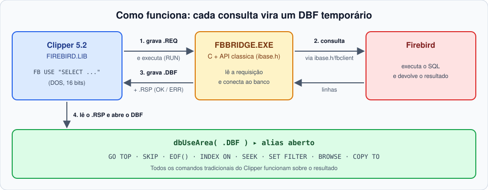
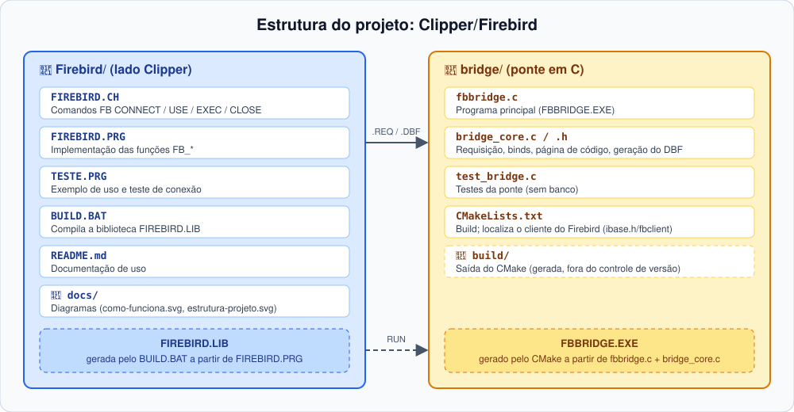

# FIREBIRD.LIB

**Consultas Firebird em Clipper 5.2 (DOS, 16 bits)**, com a sintaxe e as ferramentas que você já conhece.

O Clipper 5.2 não consegue usar o cliente Firebird diretamente. Esta biblioteca resolve isso com uma ponte em C: cada consulta vira um **DBF temporário**, aberto com `dbUseArea()`. A partir daí, todos os comandos tradicionais (`GO TOP`, `SKIP`, `EOF()`, `INDEX ON`, `SEEK`, `SET FILTER`, `BROWSE`, `COPY TO`...) funcionam normalmente sobre o resultado.

## Sumário

- [Como funciona](#como-funciona)
- [Estrutura do projeto](#estrutura-do-projeto)
- [Início rápido](#início-rápido)
- [Referência da API](#referência-da-api)
- [Instalação](#instalação)
- [Instalando o cliente do Firebird](#instalando-o-cliente-do-firebird)
- [Conversões e limites](#conversões-e-limites)
- [Segurança](#segurança)
- [Testes](#testes)

## Como funciona



1. A biblioteca grava um arquivo de requisição (conexão, SQL e binds).
2. Executa `FBBRIDGE.EXE` via `RUN`.
3. A ponte consulta o Firebird (via a API clássica `ibase.h`/`fbclient`), grava o resultado em DBF e responde `OK` ou `ERR` em um arquivo `.RSP`.
4. A biblioteca abre o DBF com o alias informado.

## Estrutura do projeto



| Arquivo | Função |
|---------|--------|
| `FIREBIRD.CH` | Comandos `FB ...` (`#include "firebird.ch"`) |
| `FIREBIRD.PRG` | Implementação das funções `FB_*` |
| `TESTE.PRG` | Exemplo de uso e teste de conexão |
| `BUILD.BAT` | Compila a biblioteca `FIREBIRD.LIB` |
| `bridge/fbbridge.c` | Programa principal da ponte (`FBBRIDGE.EXE`) |
| `bridge/bridge_core.c/.h` | Núcleo: requisição, binds, página de código e geração do DBF |
| `bridge/test_bridge.c` | Testes da ponte (sem banco) |
| `bridge/CMakeLists.txt` | Build da ponte (localiza o cliente do Firebird já instalado) |

## Início rápido

```clipper
#include "firebird.ch"

FB CONNECT USER "usr" PASSWORD "pwd" DSN "host/3050:C:\BANCOS\PRODCTL.FDB"

FB USE "SELECT * FROM F0005 WHERE DRSY = ? AND DRRT = ?" ALIAS F0005 BIND cSy, cRt
GO TOP
DO WHILE !Eof()
   ? F0005->DRSY, F0005->DRKY
   SKIP
ENDDO
FB CLOSE F0005

FB EXEC "UPDATE T SET X = ? WHERE Y = ?" BIND 10, "A"

FB DISCONNECT
```

### Consultar, alterar, atualizar e apagar um registro

O DBF gerado por `FB USE` é apenas uma **cópia local** do resultado: alterar o campo nele não muda o Firebird. Para gravar, use `FB EXEC` com `UPDATE`/`DELETE`, filtrando pela chave do registro. Cada `FB EXEC` já faz `COMMIT` ao final.

```clipper
#include "firebird.ch"

LOCAL cSy := "00", cRt := "UM", cKy := "ABC"
LOCAL cDesc, nAfetadas

FB CONNECT USER "usr" PASSWORD "pwd" DSN "host/3050:C:\BANCOS\PRODCTL.FDB"

// 1. Consulta o registro
FB USE "SELECT DRDL01 FROM F0005 WHERE DRSY = ? AND DRRT = ? AND DRKY = ?" ;
    ALIAS F0005 BIND cSy, cRt, cKy

IF Eof()
   ? "Registro não encontrado."
   FB CLOSE F0005
   FB DISCONNECT
   RETURN
ENDIF

// 2. Altera o campo (em memória)
cDesc := Upper( AllTrim( F0005->DRDL01 ) ) + " - REVISADO"
FB CLOSE F0005

// 3. Atualiza a tabela no Firebird
nAfetadas := FB_Exec( "UPDATE F0005 SET DRDL01 = ? WHERE DRSY = ? AND DRRT = ? AND DRKY = ?", ;
                      { cDesc, cSy, cRt, cKy } )
IF nAfetadas == -1
   ? "Falha no UPDATE:", FB_Error()
ELSE
   ? nAfetadas, "registro(s) atualizado(s)."
ENDIF

// 4. Apaga o registro
nAfetadas := FB_Exec( "DELETE FROM F0005 WHERE DRSY = ? AND DRRT = ? AND DRKY = ?", ;
                      { cSy, cRt, cKy } )
IF nAfetadas == -1
   ? "Falha no DELETE:", FB_Error()
ELSE
   ? nAfetadas, "registro(s) apagado(s)."
ENDIF

FB DISCONNECT
```

## Referência da API

### Comandos e funções equivalentes

| Comando | Função | Retorno | Descrição |
|---------|--------|---------|-----------|
| `FB CONNECT USER u PASSWORD p DSN d` | `FB_Connect()` | `.T.` / `.F.` | Abre a conexão com o Firebird usando usuário, senha e DSN. Deve ser o primeiro passo antes de qualquer consulta. |
| `FB USE cSql ALIAS a BIND v1, v2...` | `FB_Use()` | `.T.` / `.F.` | Executa um `SELECT` e carrega o resultado em uma área de trabalho (DBF temporário) com o alias informado, para navegar com `DBSKIP`, `EOF()` etc. Os valores de `BIND` substituem os `?` do SQL, na ordem em que aparecem. |
| `FB EXEC cSql BIND v1, v2...` | `FB_Exec()` | linhas afetadas, ou `-1` em erro | Executa comandos que não retornam dados (`INSERT`, `UPDATE`, `DELETE`, DDL, blocos `EXECUTE BLOCK`) e informa quantas linhas foram afetadas. |
| `FB CLOSE alias` | — | fecha a área e apaga o DBF temporário | Encerra a consulta aberta com `FB USE` e limpa o arquivo temporário criado para ela. |
| `FB DISCONNECT` | — | descarta os dados da conexão | Encerra a sessão com o Firebird, esquecendo usuário, senha e DSN. Use ao final do programa. |

Funções auxiliares:

| Função | Descrição |
|--------|-----------|
| `FB_Error()` | Texto do último erro |
| `FB_Truncated()` | Indica se o resultado foi truncado (por exemplo, por `MAXROWS`) |
| `FB_Config(cChave, xValor)` | Lê ou altera uma configuração; retorna o valor anterior |

**`FB_Error()`** — use logo após uma chamada que falhou:

```clipper
IF !FB_Use( "SELECT * FROM F0005", "F0005" )
   ? "Falha na consulta:", FB_Error()
   RETURN
ENDIF

IF FB_Exec( "UPDATE T SET X = ? WHERE Y = ?", { 10, "A" } ) == -1
   ? "Falha no UPDATE:", FB_Error()
ENDIF
```

**`FB_Truncated()`** — use depois de `FB USE` para saber se o `MAXROWS` cortou o resultado:

```clipper
FB_Config( "MAXROWS", 1000 )
FB USE "SELECT * FROM F0911" ALIAS F0911

IF FB_Truncated()
   ? "Atenção: só as primeiras 1000 linhas foram carregadas."
ENDIF
```

**`FB_Config()`** — sem valor, lê; com valor, altera e devolve o valor anterior:

```clipper
? FB_Config( "MAXROWS" )                  // 65000 (lê)

FB_Config( "WORKDIR", "C:\TMP" )          // pasta dos temporários
FB_Config( "BRIDGE", "C:\FB\FBBRIDGE.EXE" )
FB_Config( "CODEPAGE", "cp437" )

// altera temporariamente e restaura depois
nAnt := FB_Config( "MAXROWS", 0 )         // 0 = sem limite
FB USE "SELECT * FROM F0005" ALIAS F0005
FB_Config( "MAXROWS", nAnt )
```

### Configurações (`FB_Config`)

| Chave | Padrão | Descrição |
|-------|--------|-----------|
| `BRIDGE` | `FBBRIDGE.EXE` | Caminho do executável da ponte |
| `WORKDIR` | `%TEMP%` | Pasta dos arquivos temporários (REQ, RSP, DBF) |
| `CODEPAGE` | `cp850` | Página de código dos textos retornados |
| `MAXROWS` | `65000` | Máximo de linhas por consulta (`0` = sem limite) |

## Instalação

1. **Instalar o cliente do Firebird** (o instalador completo do servidor já inclui o cliente; também dá para usar só o pacote de cliente), no `PATH` ou na pasta do `FBBRIDGE.EXE`. A arquitetura (32/64 bits) deve ser a mesma do executável. Sem ele, a ponte não consegue nem carregar. Veja o [passo a passo](#instalando-o-cliente-do-firebird).
2. **Compilar a ponte** (CMake + compilador C; o CMake localiza o `ibase.h`/`fbclient` já instalado):
   ```
   cd bridge
   cmake -S . -B build
   cmake --build build
   ```
   O resultado é `build\FBBRIDGE.EXE` (no MinGW, executável estático).
   - MinGW: use `-G "MinGW Makefiles"`.
   - Se o CMake não achar o Firebird sozinho: `-DFIREBIRD_ROOT="C:/Program Files/Firebird/Firebird_5_0"`.
3. **Compilar a biblioteca** com `BUILD.BAT` (ajuste para o seu Clipper/linker) e ligar com `FIREBIRD.LIB`. Veja `TESTE.PRG`.
4. **Manter o `FBBRIDGE.EXE` acessível**: pasta atual, `PATH` ou `FB_Config("BRIDGE", ...)`.

> **Ambiente de execução:** o Clipper precisa rodar onde o `RUN` consiga executar programas Windows. No Windows 32 bits use NTVDM, com a ponte compilada em 32 bits. No Windows 64 bits use DOSBox ou similar, com uma ponte de execução.

## Instalando o cliente do Firebird

1. **Descobrir a arquitetura.** Deve ser a mesma (32 ou 64 bits) do `FBBRIDGE.EXE`. Com Clipper em NTVDM (Windows 32 bits), compile e use tudo em 32 bits; caso contrário, use 64 bits.
2. **Baixar o instalador** em <https://firebirdsql.org/en/downloads/>: escolha a versão estável mais recente (5.0) para Windows, na arquitetura desejada. O instalador completo já traz o `fbclient.dll`, o SDK (`ibase.h`) e, se quiser, o próprio servidor.
3. **Instalar.** Se o Firebird vai rodar só como cliente (o servidor está em outra máquina), pode escolher "Client components only" no instalador; se o banco `.fdb` é local, instale o servidor completo (modo *Super Server* de single instância é o mais simples).
4. **Localizar a instalação**, por padrão `C:\Program Files\Firebird\Firebird_5_0`. Essa pasta contém `include\ibase.h` (SDK) e `fbclient.lib`/`fbclient.dll` em `lib\`/na raiz — é o caminho a passar em `-DFIREBIRD_ROOT=...` ao configurar o CMake, se ele não achar sozinho.
5. **Colocar o `fbclient.dll` acessível ao `FBBRIDGE.EXE`**, de uma destas formas:
   - *Global:* Painel de Controle → Sistema → Configurações avançadas → Variáveis de ambiente → em `Path` adicione a pasta da instalação do Firebird (onde está o `fbclient.dll`). Feche e reabra o terminal/IDE.
   - *Local:* copie `fbclient.dll` para o diretório do `FBBRIDGE.EXE` (a ponte procura as DLLs primeiro ali).
6. **Verificar** em um novo terminal:
   ```
   where fbclient.dll
   ```
   Deve mostrar o caminho da pasta.
7. **Testar a conexão** com `TESTE.PRG` (ajuste usuário, senha e DSN). O DSN usa o formato `host/porta:caminho\banco.fdb` (porta opcional, padrão `3050`); para um banco só local, `caminho\banco.fdb` já basta.

### Problemas comuns

| Erro | Causa provável |
|------|----------------|
| A ponte não responde / `FBBRIDGE.EXE` não abre | `fbclient.dll` fora do `PATH`, ou arquitetura diferente da ponte (32 x 64 bits). |
| `unavailable database` / `connection refused` | Serviço do Firebird (`fbserver`/`fbguard`) não está rodando, ou porta bloqueada. |
| `I/O error ... file not found` | Caminho do `.fdb` incorreto no DSN, ou pasta sem permissão para o usuário do Firebird. |
| `your user name and password are not defined` | Usuário/senha incorretos, ou usuário criado no `SEC$USERS` errado (Firebird 3+ tem múltiplos plugins de autenticação). |
| `Dynamic SQL Error ... unexpected end of command` | Sobrou um `;` no fim do SQL fora de um bloco `EXECUTE BLOCK`/PSQL — a ponte remove automaticamente, mas confira se o SQL não tem mais de um comando. |

## Conversões e limites

**Tipos Firebird → campos DBF**

| Firebird | DBF | Observação |
|----------|-----|------------|
| `NUMERIC` / `DECIMAL` / `SMALLINT` / `INTEGER` / `BIGINT` | `N` | Máx. 19 posições; se não couber, reduz decimais e, em último caso, vira `C` |
| `FLOAT` / `DOUBLE PRECISION` | `N` | Convertido para o texto decimal mais curto que reproduz o valor |
| `DATE` / `TIMESTAMP` | `D` | A hora é descartada |
| `TIME` | `C` | Formato `HH:MM:SS` (Clipper não tem um tipo hora) |
| `BOOLEAN` | `L` | Firebird 3+ |
| `CHAR` / `VARCHAR` | `C` | Máx. 254; o excedente é cortado |
| `BLOB SUB_TYPE TEXT` | `C` | Truncado |
| `BLOB SUB_TYPE BINARY` / outros subtipos | `C` | Em hexadecimal |

**Regras gerais**

- Nomes de coluna viram nomes de campo válidos: máx. 10 caracteres, maiúsculos e únicos.
- Binds são posicionais (preenchem os `?` do SQL, na ordem em que aparecem), com valores `C`, `N`, `D`, `L` ou `NIL`.
- A conexão usa charset `UTF8`; o Firebird converte para/do charset de cada coluna automaticamente.
- Cada chamada abre e fecha uma conexão: **não há transação entre chamadas**. `FB EXEC` faz `COMMIT` ao final; `FB USE` também confirma a transação de leitura ao terminar (libera bloqueios/snapshot).
- A linha de comando do `RUN` tem limite de ~127 caracteres: use caminhos curtos.

## Segurança

O arquivo de requisição contém a senha por instantes e é apagado logo após a chamada. Use uma pasta `WORKDIR` de acesso restrito e um usuário do Firebird com o mínimo de privilégios necessário.

## Testes

Os testes da ponte não precisam de banco:

```
ctest --test-dir bridge/build --output-on-failure
```

Cobrem a leitura da requisição, os binds, a conversão de página de código e a geração do DBF, e conferem que, sem banco, o `FBBRIDGE.EXE` responde `ERR` no `.RSP`.
