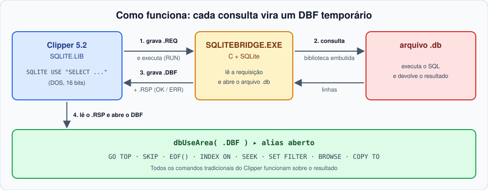
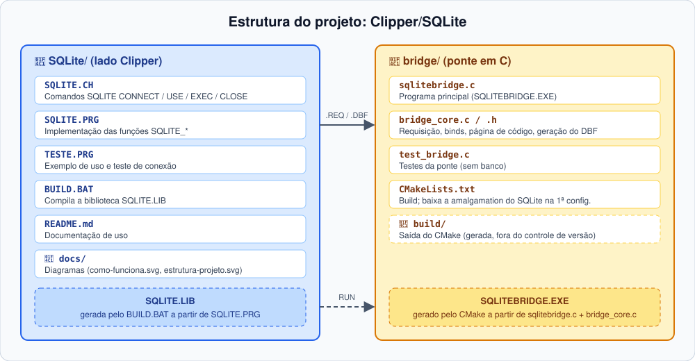

# SQLITE.LIB

**Consultas SQLite em Clipper 5.2 (DOS, 16 bits)**, com a sintaxe e as ferramentas que você já conhece.

O Clipper 5.2 não consegue usar a biblioteca do SQLite diretamente (é código C moderno, para compiladores de 32/64 bits). Esta biblioteca resolve isso com uma ponte em C: cada consulta vira um **DBF temporário**, aberto com `dbUseArea()`. A partir daí, todos os comandos tradicionais (`GO TOP`, `SKIP`, `EOF()`, `INDEX ON`, `SEEK`, `SET FILTER`, `BROWSE`, `COPY TO`...) funcionam normalmente sobre o resultado.

Como o SQLite não tem servidor nem usuário/senha — é só um arquivo `.db` — não há nada para instalar além do compilador: sem cliente externo, sem variáveis de ambiente.

## Sumário

- [Como funciona](#como-funciona)
- [Estrutura do projeto](#estrutura-do-projeto)
- [Início rápido](#início-rápido)
- [Referência da API](#referência-da-api)
- [Instalação](#instalação)
- [Conversões e limites](#conversões-e-limites)
- [Segurança](#segurança)
- [Testes](#testes)

## Como funciona



1. A biblioteca grava um arquivo de requisição (caminho do `.db`, SQL e binds).
2. Executa `SQLITEBRIDGE.EXE` via `RUN`.
3. A ponte abre o arquivo (criando-o se ainda não existir), executa o SQL, grava o resultado em DBF e responde `OK` ou `ERR` em um arquivo `.RSP`.
4. A biblioteca abre o DBF com o alias informado.

## Estrutura do projeto



| Arquivo | Função |
|---------|--------|
| `SQLITE.CH` | Comandos `SQLITE ...` (`#include "sqlite.ch"`) |
| `SQLITE.PRG` | Implementação das funções `SQLITE_*` |
| `TESTE.PRG` | Exemplo de uso e teste de conexão |
| `BUILD.BAT` | Compila a biblioteca `SQLITE.LIB` |
| `bridge/sqlitebridge.c` | Programa principal da ponte (`SQLITEBRIDGE.EXE`) |
| `bridge/bridge_core.c/.h` | Núcleo: requisição, binds, página de código e geração do DBF |
| `bridge/test_bridge.c` | Testes da ponte (sem banco) |
| `bridge/CMakeLists.txt` | Build da ponte (baixa a amalgamation do SQLite na primeira configuração) |

## Início rápido

```clipper
#include "sqlite.ch"

SQLITE CONNECT FILE "C:\DADOS\SISTEMA.DB"

SQLITE USE "SELECT * FROM F0005 WHERE DRSY = :1 AND DRRT = :2" ALIAS F0005 BIND cSy, cRt
GO TOP
DO WHILE !Eof()
   ? F0005->DRSY, F0005->DRKY
   SKIP
ENDDO
SQLITE CLOSE F0005

SQLITE EXEC "UPDATE T SET X = :1 WHERE Y = :2" BIND 10, "A"

SQLITE DISCONNECT
```

### Consultar, alterar, atualizar e apagar um registro

O DBF gerado por `SQLITE USE` é apenas uma **cópia local** do resultado: alterar o campo nele não muda o banco. Para gravar, use `SQLITE EXEC` com `UPDATE`/`DELETE`, filtrando pela chave do registro. Cada comando é gravado assim que termina (o SQLite roda em modo autocommit fora de uma transação explícita).

```clipper
#include "sqlite.ch"

LOCAL cSy := "00", cRt := "UM", cKy := "ABC"
LOCAL cDesc, nAfetadas

SQLITE CONNECT FILE "C:\DADOS\SISTEMA.DB"

// 1. Consulta o registro
SQLITE USE "SELECT DRDL01 FROM F0005 WHERE DRSY = :1 AND DRRT = :2 AND DRKY = :3" ;
    ALIAS F0005 BIND cSy, cRt, cKy

IF Eof()
   ? "Registro não encontrado."
   SQLITE CLOSE F0005
   SQLITE DISCONNECT
   RETURN
ENDIF

// 2. Altera o campo (em memória)
cDesc := Upper( AllTrim( F0005->DRDL01 ) ) + " - REVISADO"
SQLITE CLOSE F0005

// 3. Atualiza a tabela no banco
nAfetadas := SQLITE_Exec( "UPDATE F0005 SET DRDL01 = :1 WHERE DRSY = :2 AND DRRT = :3 AND DRKY = :4", ;
                          { cDesc, cSy, cRt, cKy } )
IF nAfetadas == -1
   ? "Falha no UPDATE:", SQLITE_Error()
ELSE
   ? nAfetadas, "registro(s) atualizado(s)."
ENDIF

// 4. Apaga o registro
nAfetadas := SQLITE_Exec( "DELETE FROM F0005 WHERE DRSY = :1 AND DRRT = :2 AND DRKY = :3", ;
                          { cSy, cRt, cKy } )
IF nAfetadas == -1
   ? "Falha no DELETE:", SQLITE_Error()
ELSE
   ? nAfetadas, "registro(s) apagado(s)."
ENDIF

SQLITE DISCONNECT
```

## Referência da API

### Comandos e funções equivalentes

| Comando | Função | Retorno | Descrição |
|---------|--------|---------|-----------|
| `SQLITE CONNECT FILE f` | `SQLITE_Connect()` | `.T.` / `.F.` | Testa o arquivo `.db` (criando-o se não existir) e guarda o caminho. Deve ser o primeiro passo antes de qualquer consulta. |
| `SQLITE USE cSql ALIAS a BIND v1, v2...` | `SQLITE_Use()` | `.T.` / `.F.` | Executa um `SELECT` e carrega o resultado em uma área de trabalho (DBF temporário) com o alias informado, para navegar com `DBSKIP`, `EOF()` etc. Os valores de `BIND` substituem `:1`, `:2`... no SQL. |
| `SQLITE EXEC cSql BIND v1, v2...` | `SQLITE_Exec()` | linhas afetadas, ou `-1` em erro | Executa comandos que não retornam dados (`INSERT`, `UPDATE`, `DELETE`, `CREATE TABLE`...) e informa quantas linhas foram afetadas. |
| `SQLITE CLOSE alias` | — | fecha a área e apaga o DBF temporário | Encerra a consulta aberta com `SQLITE USE` e limpa o arquivo temporário criado para ela. |
| `SQLITE DISCONNECT` | — | descarta os dados da conexão | Encerra a sessão, esquecendo o caminho do arquivo. Use ao final do programa. |

Funções auxiliares:

| Função | Descrição |
|--------|-----------|
| `SQLITE_Error()` | Texto do último erro |
| `SQLITE_Truncated()` | Indica se o resultado foi truncado (por exemplo, por `MAXROWS`) |
| `SQLITE_Config(cChave, xValor)` | Lê ou altera uma configuração; retorna o valor anterior |

**`SQLITE_Error()`** — use logo após uma chamada que falhou:

```clipper
IF !SQLITE_Use( "SELECT * FROM F0005", "F0005" )
   ? "Falha na consulta:", SQLITE_Error()
   RETURN
ENDIF

IF SQLITE_Exec( "UPDATE T SET X = :1 WHERE Y = :2", { 10, "A" } ) == -1
   ? "Falha no UPDATE:", SQLITE_Error()
ENDIF
```

**`SQLITE_Truncated()`** — use depois de `SQLITE USE` para saber se o `MAXROWS` cortou o resultado:

```clipper
SQLITE_Config( "MAXROWS", 1000 )
SQLITE USE "SELECT * FROM F0911" ALIAS F0911

IF SQLITE_Truncated()
   ? "Atenção: só as primeiras 1000 linhas foram carregadas."
ENDIF
```

**`SQLITE_Config()`** — sem valor, lê; com valor, altera e devolve o valor anterior:

```clipper
? SQLITE_Config( "MAXROWS" )               // 65000 (lê)

SQLITE_Config( "WORKDIR", "C:\TMP" )       // pasta dos temporários
SQLITE_Config( "BRIDGE", "C:\SQLITE\SQLITEBRIDGE.EXE" )
SQLITE_Config( "CODEPAGE", "cp437" )

// altera temporariamente e restaura depois
nAnt := SQLITE_Config( "MAXROWS", 0 )      // 0 = sem limite
SQLITE USE "SELECT * FROM F0005" ALIAS F0005
SQLITE_Config( "MAXROWS", nAnt )
```

### Configurações (`SQLITE_Config`)

| Chave | Padrão | Descrição |
|-------|--------|-----------|
| `BRIDGE` | `SQLITEBRIDGE.EXE` | Caminho do executável da ponte |
| `WORKDIR` | `%TEMP%` | Pasta dos arquivos temporários (REQ, RSP, DBF) |
| `CODEPAGE` | `cp850` | Página de código dos textos retornados |
| `MAXROWS` | `65000` | Máximo de linhas por consulta (`0` = sem limite) |

## Instalação

1. **Compilar a ponte** (CMake + compilador C; a amalgamation do SQLite é baixada do site oficial na primeira configuração):
   ```
   cd bridge
   cmake -S . -B build
   cmake --build build
   ```
   O resultado é `build\SQLITEBRIDGE.EXE` (no MinGW, executável estático).
   - MinGW: use `-G "MinGW Makefiles"`.
   - Sem internet: `-DFETCHCONTENT_SOURCE_DIR_SQLITE3=<pasta com sqlite3.c e sqlite3.h>`.
2. **Compilar a biblioteca** com `BUILD.BAT` (ajuste para o seu Clipper/linker) e ligar com `SQLITE.LIB`. Veja `TESTE.PRG`.
3. **Manter o `SQLITEBRIDGE.EXE` acessível**: pasta atual, `PATH` ou `SQLITE_Config("BRIDGE", ...)`.

> **Ambiente de execução:** o Clipper precisa rodar onde o `RUN` consiga executar programas Windows. No Windows 32 bits use NTVDM, com a ponte compilada em 32 bits. No Windows 64 bits use DOSBox ou similar, com uma ponte de execução.

Diferente da versão Oracle desta biblioteca, não há Instant Client nem variáveis de ambiente para configurar: o SQLite está embutido no próprio `SQLITEBRIDGE.EXE`, e o "banco" é só o caminho de um arquivo.

### Problemas comuns

| Erro | Causa provável |
|------|----------------|
| `unable to open database file` | Pasta do arquivo `.db` não existe, ou sem permissão de escrita nela. |
| `database is locked` | Outro processo (outra estação, outro programa) mantém o arquivo aberto com uma transação pendente. |
| `A ponte nao respondeu` | `SQLITEBRIDGE.EXE` não está no `PATH` nem na pasta atual — ajuste com `SQLITE_Config("BRIDGE", ...)`. |

## Conversões e limites

**Tipos SQLite → campos DBF**

O SQLite tem tipagem dinâmica (cada valor guarda seu próprio tipo, independente da coluna). A ponte decide o tipo do campo pelo tipo declarado da coluna (`INTEGER`, `REAL`, `TEXT`, `DATE`..., da cláusula `CREATE TABLE`); numa expressão sem tipo declarado (`COUNT(*)`, literais...), usa o tipo do primeiro valor não nulo encontrado.

| SQLite | DBF | Observação |
|--------|-----|------------|
| `INTEGER`, `REAL`, `NUMERIC`, `DECIMAL` | `N` | `INTEGER` guarda até 64 bits; `REAL` é `double` (± 15-17 dígitos significativos) — sem a precisão decimal arbitrária do `NUMBER` do Oracle |
| `DATE`, `DATETIME`, `TIMESTAMP` | `D` | Aceita texto ISO-8601 (`AAAA-MM-DD...`) ou `INTEGER` com segundos desde 1970 (epoch Unix); a hora é descartada. Coluna gravada como número juliano (`REAL`) não é convertida |
| `BOOLEAN` | `L` | Qualquer valor diferente de zero é `.T.` |
| `TEXT`, `CHAR`, `VARCHAR`, `CLOB` | `C` | Máx. 254; o excedente é cortado |
| `BLOB` | `C` | Em hexadecimal, truncado |

**Regras gerais**

- Nomes de coluna viram nomes de campo válidos: máx. 10 caracteres, maiúsculos e únicos.
- Binds são posicionais (`:1`, `:2`...), com valores `C`, `N`, `D`, `L` ou `NIL`. Um bind `D` vira texto `"AAAA-MM-DD"` (a data vazia `CTOD("")` vira `NULL`); um bind `N` vira `INTEGER` quando não tem parte fracionária, senão `REAL`.
- Cada chamada abre e fecha o arquivo: **não há transação entre chamadas**. `SQLITE EXEC` grava (autocommit) ao final de cada comando.
- A linha de comando do `RUN` tem limite de ~127 caracteres: use caminhos curtos.

## Segurança

O arquivo de requisição contém o caminho do banco (sem senha, já que o SQLite não tem) e é apagado logo após a chamada. Como o SQLite não faz autenticação, quem tiver acesso de leitura/escrita ao arquivo `.db` tem acesso completo aos dados — a segurança depende inteiramente das permissões do sistema de arquivos na pasta onde ele fica. Use uma pasta `WORKDIR` de acesso restrito para os temporários.

## Testes

Os testes da ponte não precisam de banco:

```
ctest --test-dir bridge/build --output-on-failure
```

Cobrem a leitura da requisição, os binds, a conversão de página de código e a geração do DBF, e conferem que, com um arquivo `.db` inacessível, o `SQLITEBRIDGE.EXE` responde `ERR` no `.RSP`.
