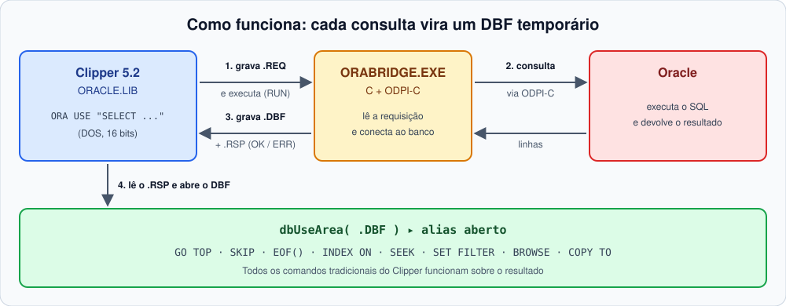
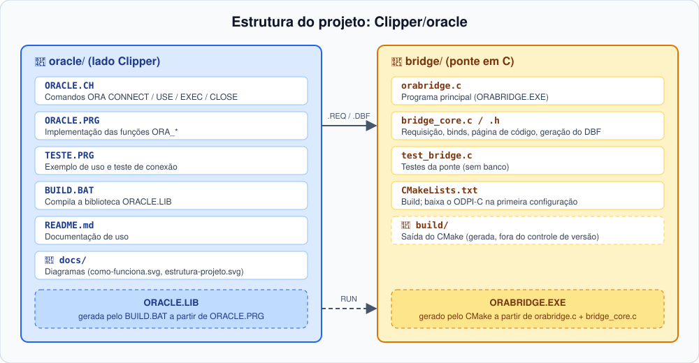

# ORACLE.LIB

**Consultas Oracle em Clipper 5.2 (DOS, 16 bits)**, com a sintaxe e as ferramentas que você já conhece.

O Clipper 5.2 não consegue usar o cliente Oracle diretamente. Esta biblioteca resolve isso com uma ponte em C: cada consulta vira um **DBF temporário**, aberto com `dbUseArea()`. A partir daí, todos os comandos tradicionais (`GO TOP`, `SKIP`, `EOF()`, `INDEX ON`, `SEEK`, `SET FILTER`, `BROWSE`, `COPY TO`...) funcionam normalmente sobre o resultado.

## Sumário

- [Como funciona](#como-funciona)
- [Estrutura do projeto](#estrutura-do-projeto)
- [Início rápido](#início-rápido)
- [Referência da API](#referência-da-api)
- [Instalação](#instalação)
- [Instalando o Oracle Instant Client](#instalando-o-oracle-instant-client)
- [Conversões e limites](#conversões-e-limites)
- [Segurança](#segurança)
- [Testes](#testes)

## Como funciona



1. A biblioteca grava um arquivo de requisição (conexão, SQL e binds).
2. Executa `ORABRIDGE.EXE` via `RUN`.
3. A ponte consulta o Oracle (via ODPI-C), grava o resultado em DBF e responde `OK` ou `ERR` em um arquivo `.RSP`.
4. A biblioteca abre o DBF com o alias informado.

## Estrutura do projeto



| Arquivo | Função |
|---------|--------|
| `ORACLE.CH` | Comandos `ORA ...` (`#include "oracle.ch"`) |
| `ORACLE.PRG` | Implementação das funções `ORA_*` |
| `TESTE.PRG` | Exemplo de uso e teste de conexão |
| `BUILD.BAT` | Compila a biblioteca `ORACLE.LIB` |
| `bridge/orabridge.c` | Programa principal da ponte (`ORABRIDGE.EXE`) |
| `bridge/bridge_core.c/.h` | Núcleo: requisição, binds, página de código e geração do DBF |
| `bridge/test_bridge.c` | Testes da ponte (sem banco) |
| `bridge/CMakeLists.txt` | Build da ponte (baixa o ODPI-C na primeira configuração) |

## Início rápido

```clipper
#include "oracle.ch"

ORA CONNECT USER "usr" PASSWORD "pwd" DSN "host:1544/servico"

ORA USE "SELECT * FROM F0005 WHERE DRSY = :1 AND DRRT = :2" ALIAS F0005 BIND cSy, cRt
GO TOP
DO WHILE !Eof()
   ? F0005->DRSY, F0005->DRKY
   SKIP
ENDDO
ORA CLOSE F0005

ORA EXEC "UPDATE T SET X = :1 WHERE Y = :2" BIND 10, "A"

ORA DISCONNECT
```

## Referência da API

### Comandos e funções equivalentes

| Comando | Função | Retorno |
|---------|--------|---------|
| `ORA CONNECT USER u PASSWORD p DSN d` | `ORA_Connect()` | `.T.` / `.F.` |
| `ORA USE cSql ALIAS a BIND v1, v2...` | `ORA_Use()` | `.T.` / `.F.` |
| `ORA EXEC cSql BIND v1, v2...` | `ORA_Exec()` | linhas afetadas, ou `-1` em erro |
| `ORA CLOSE alias` | — | fecha a área e apaga o DBF temporário |
| `ORA DISCONNECT` | — | descarta os dados da conexão |

Funções auxiliares:

| Função | Descrição |
|--------|-----------|
| `ORA_Error()` | Texto do último erro |
| `ORA_Truncated()` | Indica se o resultado foi truncado (por exemplo, por `MAXROWS`) |
| `ORA_Config(cChave, xValor)` | Lê ou altera uma configuração; retorna o valor anterior |

**`ORA_Error()`** — use logo após uma chamada que falhou:

```clipper
IF !ORA_Use( "SELECT * FROM F0005", "F0005" )
   ? "Falha na consulta:", ORA_Error()
   RETURN
ENDIF

IF ORA_Exec( "UPDATE T SET X = :1 WHERE Y = :2", { 10, "A" } ) == -1
   ? "Falha no UPDATE:", ORA_Error()
ENDIF
```

**`ORA_Truncated()`** — use depois de `ORA USE` para saber se o `MAXROWS` cortou o resultado:

```clipper
ORA_Config( "MAXROWS", 1000 )
ORA USE "SELECT * FROM F0911" ALIAS F0911

IF ORA_Truncated()
   ? "Atenção: só as primeiras 1000 linhas foram carregadas."
ENDIF
```

**`ORA_Config()`** — sem valor, lê; com valor, altera e devolve o valor anterior:

```clipper
? ORA_Config( "MAXROWS" )                  // 65000 (lê)

ORA_Config( "WORKDIR", "C:\TMP" )          // pasta dos temporários
ORA_Config( "BRIDGE", "C:\ORA\ORABRIDGE.EXE" )
ORA_Config( "CODEPAGE", "cp437" )

// altera temporariamente e restaura depois
nAnt := ORA_Config( "MAXROWS", 0 )         // 0 = sem limite
ORA USE "SELECT * FROM F0005" ALIAS F0005
ORA_Config( "MAXROWS", nAnt )
```

### Configurações (`ORA_Config`)

| Chave | Padrão | Descrição |
|-------|--------|-----------|
| `BRIDGE` | `ORABRIDGE.EXE` | Caminho do executável da ponte |
| `WORKDIR` | `%TEMP%` | Pasta dos arquivos temporários (REQ, RSP, DBF) |
| `CODEPAGE` | `cp850` | Página de código dos textos retornados |
| `MAXROWS` | `65000` | Máximo de linhas por consulta (`0` = sem limite) |

## Instalação

1. **Instalar o Oracle Instant Client** (Basic ou Basic Light), no `PATH` ou na pasta do `ORABRIDGE.EXE`. A arquitetura (32/64 bits) deve ser a mesma do executável. Sem ele, a ponte responde `ERR` com `DPI-1047`. Veja o [passo a passo](#instalando-o-oracle-instant-client).
2. **Compilar a ponte** (CMake + compilador C; o ODPI-C é baixado do GitHub na primeira configuração):
   ```
   cd bridge
   cmake -S . -B build
   cmake --build build
   ```
   O resultado é `build\ORABRIDGE.EXE` (no MinGW, executável estático).
   - MinGW: use `-G "MinGW Makefiles"`.
   - Sem internet: `-DFETCHCONTENT_SOURCE_DIR_ODPI=<pasta do odpi>`.
3. **Compilar a biblioteca** com `BUILD.BAT` (ajuste para o seu Clipper/linker) e ligar com `ORACLE.LIB`. Veja `TESTE.PRG`.
4. **Manter o `ORABRIDGE.EXE` acessível**: pasta atual, `PATH` ou `ORA_Config("BRIDGE", ...)`.

> **Ambiente de execução:** o Clipper precisa rodar onde o `RUN` consiga executar programas Windows. No Windows 32 bits use NTVDM, com a ponte compilada em 32 bits. No Windows 64 bits use DOSBox ou similar, com uma ponte de execução.

## Instalando o Oracle Instant Client

O Instant Client é um pacote `.zip` sem instalador: basta extrair e configurar o `PATH`.

1. **Descobrir a arquitetura.** Deve ser a mesma (32 ou 64 bits) do `ORABRIDGE.EXE`. Com Clipper em NTVDM (Windows 32 bits), compile e use tudo em 32 bits; caso contrário, use 64 bits.
2. **Baixar o pacote** em <https://www.oracle.com/database/technologies/instant-client/downloads.html>: escolha *Windows x64* (ou *Windows 32-bit*) e baixe o **Basic** (ou **Basic Light**, menor, só com mensagens em inglês). SDK, SQL*Plus e os demais pacotes não são necessários, e não é preciso conta Oracle.
3. **Escolher a versão** compatível com o seu banco. A 19c conecta em bancos 11.2 ou superiores; a 21c e a 23ai exigem servidores mais novos. Em caso de dúvida, use a 19c.
4. **Extrair o zip** para uma pasta sem espaços nem acentos, por exemplo `C:\oracle\instantclient_19_x`. A pasta deve conter diretamente `oci.dll`, `oraociei19.dll` etc. (sem subpasta extra).
5. **Instalar o runtime do Visual C++** (*Microsoft Visual C++ Redistributable* 2017 ou superior, mesma arquitetura do cliente). Se a ponte responder `DPI-1047` citando `vcruntime` ou erro 193, instale [vc_redist.x64.exe](https://aka.ms/vs/17/release/vc_redist.x64.exe) (64 bits) ou `vc_redist.x86.exe` (32 bits).
6. **Colocar no PATH**, de uma destas formas:
   - *Global:* Painel de Controle → Sistema → Configurações avançadas → Variáveis de ambiente → em `Path` adicione `C:\oracle\instantclient_19_x`. Feche e reabra o terminal/IDE.
   - *Local:* copie o conteúdo da pasta para o diretório do `ORABRIDGE.EXE` (a ponte procura as DLLs primeiro ali).
7. **Verificar** em um novo terminal:
   ```
   where oci.dll
   ```
   Deve mostrar o caminho da pasta. Ao rodar `ORABRIDGE.EXE`, sem o cliente ele responde `ERR` com `DPI-1047`; com o cliente instalado o erro passa a ser de conexão/requisição, e não mais de biblioteca.
8. **Testar a conexão** com `TESTE.PRG` (ajuste usuário, senha e DSN). O DSN usa o formato *Easy Connect*, `host:porta/servico`, e dispensa `tnsnames.ora`.

### Problemas comuns

| Erro | Causa provável |
|------|----------------|
| `DPI-1047: Cannot locate a 64-bit Oracle Client library` | Instant Client fora do `PATH`, ou arquitetura diferente da ponte (32 x 64 bits). |
| `DPI-1047 ... vcruntime140.dll` ou erro 193 | Falta o Visual C++ Redistributable, ou arquiteturas misturadas. |
| `ORA-12541` / `ORA-12154` | Host, porta ou serviço do DSN incorretos. |
| `DPI-1050: Oracle Client library is at version X but version Y or higher is needed` | Instant Client antigo demais; instale uma versão mais recente. |

## Conversões e limites

**Tipos Oracle → campos DBF**

| Oracle | DBF | Observação |
|--------|-----|------------|
| `NUMBER` | `N` | Máx. 19 posições; se não couber, reduz decimais e, em último caso, vira `C` |
| `DATE` / `TIMESTAMP` | `D` | A hora é descartada |
| Texto | `C` | Máx. 254; o excedente é cortado |
| `CLOB` | `C` | Truncado |
| `BLOB` / `RAW` | `C` | Em hexadecimal |

**Regras gerais**

- Nomes de coluna viram nomes de campo válidos: máx. 10 caracteres, maiúsculos e únicos.
- Binds são posicionais (`:1`, `:2`...), com valores `C`, `N`, `D`, `L` ou `NIL`.
- Cada chamada abre e fecha uma conexão: **não há transação entre chamadas**. `ORA EXEC` faz `COMMIT` ao final.
- A linha de comando do `RUN` tem limite de ~127 caracteres: use caminhos curtos.

## Segurança

O arquivo de requisição contém a senha por instantes e é apagado logo após a chamada. Use uma pasta `WORKDIR` de acesso restrito e um usuário Oracle com o mínimo de privilégios necessário.

## Testes

Os testes da ponte não precisam de banco:

```
ctest --test-dir bridge/build --output-on-failure
```

Cobrem a leitura da requisição, os binds, a conversão de página de código e a geração do DBF, e conferem que, sem banco, o `ORABRIDGE.EXE` responde `ERR` no `.RSP`.
