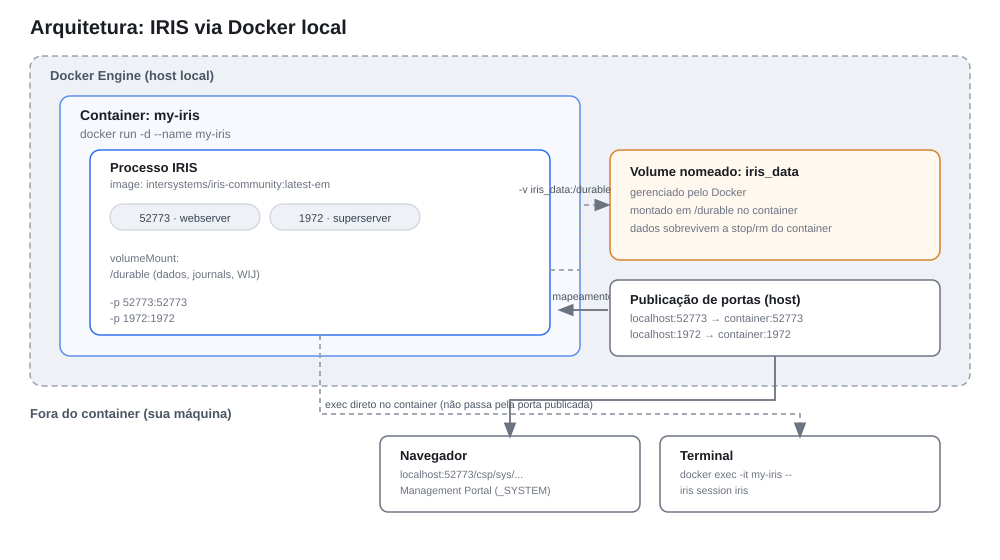
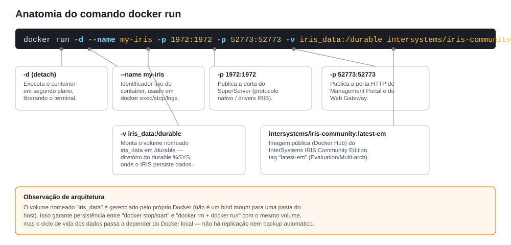

# Implantação do InterSystems IRIS via Docker Local

**Documento de Arquitetura de Solução**

| | |
|---|---|
| **Rota** | Container único via `docker run` (sem orquestrador) |
| **Escopo** | Ambiente local / desenvolvimento individual |
| **Imagem base** | `intersystems/iris-community:latest-em` (registry público) |
| **Status** | Validado |

---

## 1. Sumário Executivo

Este documento descreve a arquitetura e o procedimento para implantar o
InterSystems IRIS Community Edition como um único container Docker, executado
diretamente via `docker run`, sem depender de Kubernetes, `docker compose` ou
qualquer camada de orquestração adicional.

O objetivo é oferecer o caminho mais curto possível entre "máquina com Docker
instalado" e "instância funcional do IRIS", adequado para desenvolvimento
individual, provas de conceito (PoC) e testes exploratórios. Por não possuir
redundância, backup automatizado ou isolamento de rede além do padrão do
Docker, esta rota **não é recomendada para ambientes de produção** — ver
seção [7. Riscos e Limitações](#7-riscos-e-limitações). Para cenários que
exigem orquestração, autorecuperação de falhas e escalonamento, ver o
documento irmão [IRIS em Kubernetes Local](../Kubernets/Rota%201/IRIS-Kubernetes-Local-Arquitetura-Solucao.md).

## 2. Contexto e Objetivo

Ambientes de desenvolvimento e avaliação técnica frequentemente não
justificam a complexidade operacional de um cluster Kubernetes: não há
múltiplos desenvolvedores compartilhando o ambiente, não há requisito de alta
disponibilidade, e o ciclo de vida do ambiente costuma ser efêmero (criado e
descartado com frequência). Nesses casos, um único comando `docker run`
provê tempo de setup mínimo, superfície de configuração reduzida e uso de
apenas as ferramentas já presentes em qualquer instalação padrão do Docker
Desktop ou Docker Engine.

Esta rota utiliza exclusivamente a imagem pública `intersystems/iris-community`,
disponível no Docker Hub, dispensando conta no WRC (WRC — Worldwide Response
Center, portal de suporte da InterSystems) ou acesso a registry privado.

## 3. Visão Geral da Arquitetura



A solução é composta por dois recursos Docker que operam em conjunto: um
**volume nomeado** (`iris_data`), responsável pela persistência dos dados do
IRIS, e um **container** (`my-iris`), que executa o processo do banco de
dados e publica suas portas diretamente na interface de rede do host. Não há
camada intermediária de proxy, load balancer ou service discovery — o acesso
é direto, via `localhost`, nas portas mapeadas no momento da criação do
container.

## 4. Componentes da Solução

| Componente | Tipo (recurso Docker) | Responsabilidade |
|---|---|---|
| `iris_data` | Volume nomeado (`docker volume`) | Garante persistência dos dados do IRIS (banco, journals, WIJ) entre paradas, reinícios e recriações do container. Independente do ciclo de vida do container. |
| `my-iris` | Container (`docker run -d`) | Executa o processo IRIS, monta o volume em `/durable` e publica as portas 1972 (SuperServer) e 52773 (Management Portal / Web Gateway) no host. |
| Publicação de portas (`-p`) | Mapeamento host↔container | Expõe as portas do container diretamente em `localhost`, sem necessidade de proxy reverso ou túnel adicional. |

A anatomia completa do comando de criação, com o significado de cada flag,
está detalhada no [Anexo A](#anexo-a--anatomia-do-comando-docker-run).



## 5. Pré-requisitos

- Docker instalado e em execução, em uma das formas:
  - [Docker Desktop](https://www.docker.com/products/docker-desktop/)
    (Windows/macOS), com o motor Linux (WSL 2, no Windows) ativo;
  - Docker Engine nativo (Linux).
- Conectividade de saída para baixar a imagem pública
  `intersystems/iris-community` (Docker Hub).
- Portas `1972` e `52773` livres no host (não utilizadas por outro processo
  ou container).
- Espaço em disco disponível para o volume `iris_data` (dados do IRIS
  crescem com o uso; dimensionar conforme o cenário de testes).

Confirme os pré-requisitos com:

```bash
docker version
docker info
```

Ambos os comandos devem retornar sem erro, confirmando que o daemon do
Docker está acessível.

## 6. Procedimento de Implantação

### 6.1 Criação do container

Execute o comando abaixo (conteúdo também disponível em
[`Criar docker.cmd`](./Criar%20docker.cmd)):

```bash
docker run \
    -d \
    --name my-iris \
    -p 1972:1972 \
    -p 52773:52773 \
    -v iris_data:/durable \
    intersystems/iris-community:latest-em
```

Na primeira execução, o Docker faz o *pull* da imagem
`intersystems/iris-community:latest-em` do Docker Hub (pode levar alguns
minutos, dependendo da conexão), cria o volume nomeado `iris_data`
automaticamente (caso ainda não exista) e inicia o container em segundo
plano (`-d`).

### 6.2 Verificação da implantação

```bash
docker ps --filter name=my-iris
```

O `STATUS` deve indicar `Up` (opcionalmente com `(healthy)`, dependendo da
versão da imagem). Para acompanhar a inicialização em tempo real:

```bash
docker logs -f my-iris
```

Aguarde a mensagem de que o IRIS está pronto para aceitar conexões antes de
prosseguir. Encerre o acompanhamento com `Ctrl+C` (isso não interrompe o
container, apenas o `logs -f`).

### 6.3 Acesso ao ambiente

Management Portal:
[http://localhost:52773/csp/sys/%25CSP.Portal.Home.zen](http://localhost:52773/csp/sys/%25CSP.Portal.Home.zen)
(usuário `_SYSTEM`, senha `SYS`, com troca obrigatória no primeiro acesso).

Terminal do IRIS:

```bash
docker exec -it my-iris iris session iris
```

Conexão via driver nativo (JDBC/ODBC/.NET/Python), apontando para
`localhost:1972`, com o namespace desejado (`USER` por padrão).

### 6.4 Habilitação de interoperabilidade

No Management Portal: **System Administration → Configuration →
Namespaces** → crie um namespace marcando **"Enable Namespace for
interoperability"** (ou utilize o namespace `USER` padrão). Em seguida,
acesse **Interoperability → List Productions → New** para criar a primeira
Production.

### 6.5 Ciclo de vida do container

| Ação | Comando | Efeito sobre os dados |
|---|---|---|
| Parar | `docker stop my-iris` | Preservados (volume intacto). |
| Reiniciar | `docker start my-iris` | Preservados; container retoma com o mesmo volume. |
| Remover container | `docker rm my-iris` | Preservados, pois residem no volume `iris_data`, não no container. |
| Remover volume | `docker volume rm iris_data` | **Apagados.** Somente após remover o container e confirmar que os dados não são mais necessários. |

## 7. Riscos e Limitações

Esta arquitetura foi desenhada para desenvolvimento e testes locais em uma
única máquina. Antes de considerar qualquer evolução para ambientes
compartilhados ou produtivos, os seguintes pontos devem ser endereçados:

| Item | Situação atual | Impacto |
|---|---|---|
| Alta disponibilidade | 1 container, sem redundância nem restart policy configurada | Indisponibilidade total em caso de falha do container ou do Docker daemon; não há religamento automático (considerar `--restart unless-stopped` como mitigação mínima). |
| Orquestração | Nenhuma (sem Kubernetes/Swarm) | Sem autorecuperação, sem escalonamento, sem rolling update. |
| Exposição de rede | Portas publicadas diretamente em `0.0.0.0` do host | Qualquer processo com acesso à rede do host alcança 1972/52773; sem TLS habilitado por padrão. |
| Credenciais | Senha padrão (`SYS`) definida na primeira execução | Deve ser tratada via secret/gerenciador de segredos em ambientes reais; nunca reutilizar em produção. |
| Backup e disaster recovery | Não coberto por este documento | Requer estratégia dedicada (`docker run --rm -v iris_data:/durable ... tar` ou equivalente, backup do IRIS via `Backup.General`). |
| Observabilidade | Não coberto por este documento | Requer integração com stack de monitoramento/logging do ambiente alvo. |
| Isolamento multiusuário | Único container compartilhado, se exposto na rede | Não há segregação de recursos por usuário/equipe; recomenda-se um container por desenvolvedor. |

## 8. Troubleshooting

### 8.1 Erro `port is already allocated`

**Erro observado (exemplo):**

```
docker: Error response from daemon: driver failed programming external
connectivity on endpoint my-iris: Bind for 0.0.0.0:52773 failed: port is
already allocated.
```

**Diagnóstico:** outro container ou processo do host já está utilizando a
porta 52773 (ou 1972).

**Resolução:** identifique o processo/container em conflito e finalize-o, ou
publique o IRIS em portas alternativas do host:

```bash
docker ps --filter "publish=52773"
docker ps --filter "publish=1972"
```

```bash
docker run -d --name my-iris \
    -p 51972:1972 \
    -p 53773:52773 \
    -v iris_data:/durable \
    intersystems/iris-community:latest-em
```

Nesse caso, o Management Portal passa a ser acessado em
`http://localhost:53773/...` e conexões via driver em `localhost:51972`.

### 8.2 Container reinicia continuamente (`Restarting`) ou fica em `Exited`

**Diagnóstico:** consulte o log de inicialização para identificar a causa
raiz (falha de licença, corrupção do diretório `/durable`, recursos
insuficientes de memória):

```bash
docker logs my-iris
```

**Causas mais comuns:**

- Memória insuficiente alocada ao Docker Desktop (IRIS recomenda ao menos
  2 GB disponíveis para o container);
- Volume `iris_data` reaproveitado de uma versão de imagem incompatível —
  nesse caso, avalie iniciar com um volume novo caso os dados não precisem
  ser preservados.

### 8.3 `docker: command not found` / daemon inacessível

**Diagnóstico:** o Docker não está instalado, não está no `PATH`, ou o
daemon (Docker Desktop / `dockerd`) não está em execução.

**Resolução:**

```bash
docker info
```

Se o comando falhar, inicie o Docker Desktop (ou o serviço `docker` no
Linux: `sudo systemctl start docker`) e repita o passo
[6.1](#61-criação-do-container).

## Anexo A — Anatomia do Comando `docker run`


| Flag / argumento | Significado |
|---|---|
| `-d` | Executa o container em modo *detached* (segundo plano), liberando o terminal que disparou o comando. |
| `--name my-iris` | Define um nome fixo e legível para o container, usado em `docker exec`, `docker stop`, `docker logs` etc. Sem esse parâmetro, o Docker atribui um nome aleatório. |
| `-p 1972:1972` | Publica a porta do SuperServer do IRIS (protocolo nativo, usado por drivers JDBC/ODBC/.NET/Python) do container para a mesma porta no host. |
| `-p 52773:52773` | Publica a porta HTTP usada pelo Management Portal e pelo Web Gateway do IRIS. |
| `-v iris_data:/durable` | Monta o volume nomeado `iris_data` (criado automaticamente pelo Docker, caso não exista) no caminho `/durable` dentro do container — diretório do *durable %SYS*, onde o IRIS persiste banco de dados, journals e WIJ. |
| `intersystems/iris-community:latest-em` | Imagem pública, publicada pela InterSystems no Docker Hub, do IRIS Community Edition, na tag `latest-em`. |

## Referências

- [InterSystems IRIS Community Edition — Docker Hub](https://hub.docker.com/r/intersystems/iris-community)
- [InterSystems Documentation — Running InterSystems IRIS in Containers](https://docs.intersystems.com/iris20241/csp/docbook/DocBook.UI.Page.cls?KEY=ADOCK)
- [Docker Docs — `docker run` reference](https://docs.docker.com/reference/cli/docker/container/run/)
- [Docker Docs — Volumes](https://docs.docker.com/engine/storage/volumes/)
- [Documento irmão: Implantação do IRIS em Kubernetes Local](../Kubernets/Rota%201/IRIS-Kubernetes-Local-Arquitetura-Solucao.md)
