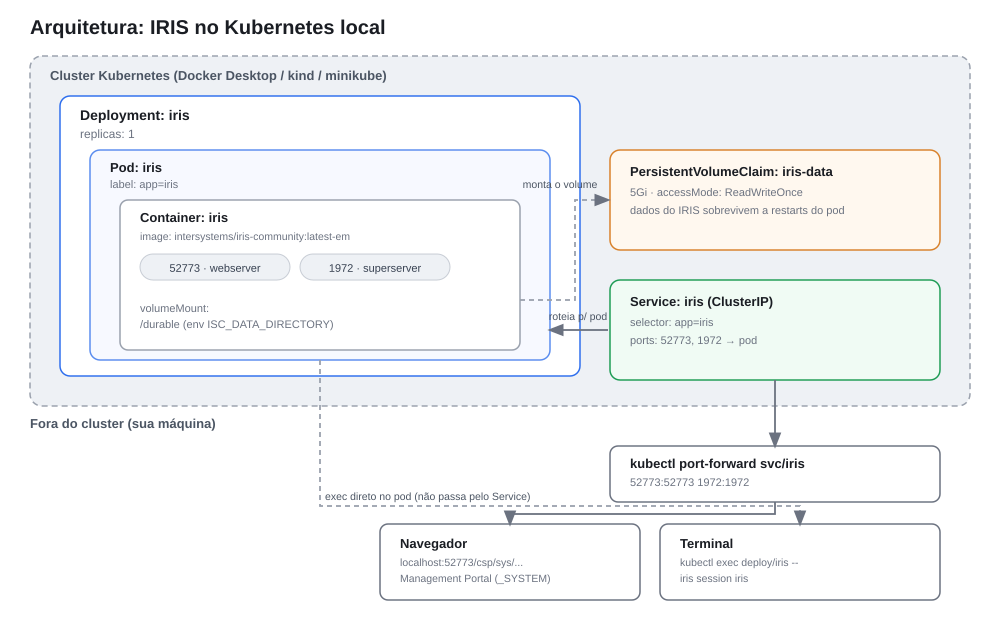
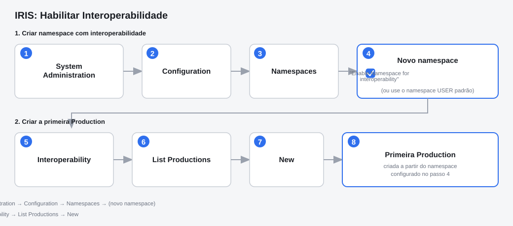
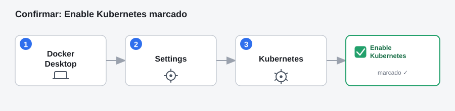
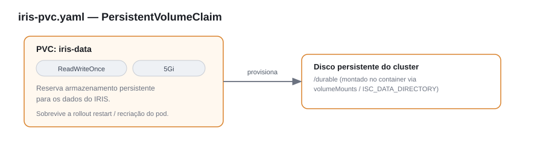
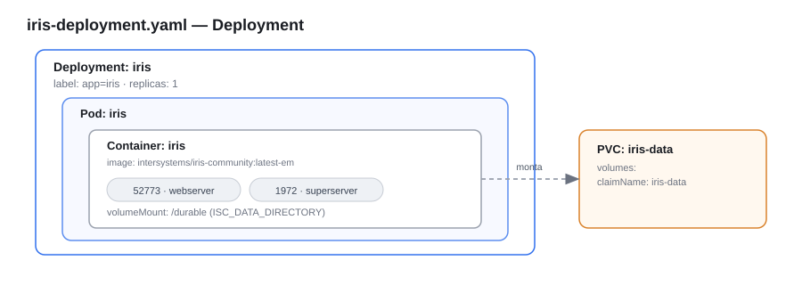
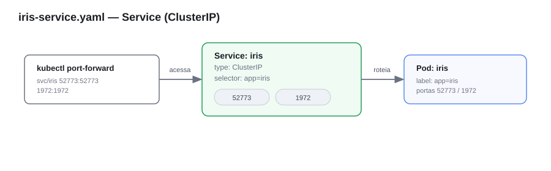

# Implantação do InterSystems IRIS em Kubernetes Local

**Documento de Arquitetura de Solução**

| | |
|---|---|
| **Rota** | 1 — Manifests Kubernetes nativos (sem operador) |
| **Escopo** | Ambiente local / desenvolvimento |
| **Imagem base** | `intersystems/iris-community:latest-em` (registry público) |
| **Status** | Validado |

---

## 1. Sumário Executivo

Este documento descreve a arquitetura e o procedimento para implantar o
InterSystems IRIS Community Edition em um cluster Kubernetes local, usando
manifests YAML padrão (`Deployment`, `Service`, `PersistentVolumeClaim`),
sem depender do IKO (InterSystems Kubernetes Operator).

A abordagem tem como objetivo prover um ambiente de desenvolvimento e testes
rápido de subir, sem necessidade de conta no WRC (WRC — Worldwide Response
Center, portal de suporte da InterSystems) nem de registry privado,
utilizando apenas a imagem pública do IRIS Community Edition. Por não
utilizar o operador oficial, esta rota **não é recomendada para ambientes de
produção** — ver seção [7. Riscos e Limitações](#7-riscos-e-limitações).

## 2. Contexto e Objetivo

A rota via IKO (operador oficial) exige registro no WRC e acesso a um
registry de imagens privado, o que introduz barreiras de entrada para
cenários de avaliação técnica, PoC (Proof of Concept) ou desenvolvimento
local. Esta rota alternativa remove essas dependências, permitindo subir uma
instância funcional do IRIS em minutos, usando apenas ferramentas
padrão do ecossistema Kubernetes.

## 3. Visão Geral da Arquitetura



A solução é composta por três objetos Kubernetes que operam em conjunto: um
`PersistentVolumeClaim` para persistência de dados, um `Deployment` que
gerencia o ciclo de vida do Pod da aplicação, e um `Service` do tipo
`ClusterIP` que expõe as portas internamente ao cluster. O acesso externo é
feito via `kubectl port-forward`, sem exposição direta via `LoadBalancer` ou
`Ingress`.

## 4. Componentes da Solução

| Componente | Tipo (recurso K8s) | Responsabilidade |
|---|---|---|
| `iris-data` | `PersistentVolumeClaim` (5Gi, `ReadWriteOnce`) | Garante persistência dos dados do IRIS entre reinicializações do Pod (restart, atualização de imagem, recriação pelo scheduler). |
| `iris` | `Deployment` (1 réplica) | Gerencia o Pod do container IRIS, monta o volume em `/durable` e expõe as portas 52773 (Management Portal / Web) e 1972 (SuperServer). |
| `iris` | `Service` (`ClusterIP`) | Roteia tráfego interno do cluster para o Pod, nas portas 52773 e 1972. Acesso externo somente via `port-forward`. |

## 5. Pré-requisitos

- Um cluster Kubernetes local disponível, através de uma das opções:
  - Docker Desktop com Kubernetes habilitado (**Settings → Kubernetes →
    Enable Kubernetes → Apply & Restart**);
  - [`kind`](https://kind.sigs.k8s.io/);
  - [`minikube`](https://minikube.sigs.k8s.io/).
- `kubectl` instalado e configurado, apontando para o context correto do
  cluster escolhido.
- Conectividade de saída para baixar a imagem pública
  `intersystems/iris-community` (Docker Hub).
- Storage class padrão configurada no cluster, para provisionamento
  dinâmico do PVC.

Confirme os pré-requisitos com:

```bash
kubectl get nodes
```

O comando deve retornar ao menos um node com `STATUS = Ready`.


Alternativas de criação de cluster:

```bash
kind create cluster
```

```bash
minikube start --driver=docker
```

## 6. Procedimento de Implantação

### 6.1 Provisionamento do armazenamento persistente

Aplique o manifest `iris-pvc.yaml` (conteúdo completo no
[Anexo A](#anexo-a--manifests-kubernetes)), que reserva 5Gi de
armazenamento para os dados do IRIS.

### 6.2 Provisionamento do workload

Aplique o manifest `iris-deployment.yaml`, que sobe 1 réplica da imagem
`intersystems/iris-community:latest-em`, expondo as portas 52773 (web) e
1972 (superserver), com o PVC montado em `/durable`.

### 6.3 Provisionamento do serviço de rede interno

Aplique o manifest `iris-service.yaml`, que cria um `Service` do tipo
`ClusterIP` expondo as mesmas portas (52773 e 1972) para acesso via
`port-forward`.

### 6.4 Aplicação dos manifests

Execute, na pasta onde os três arquivos foram salvos:

```bash
kubectl apply -f iris-pvc.yaml -f iris-deployment.yaml -f iris-service.yaml
```

### 6.5 Verificação da implantação

```bash
kubectl get pods -l app=iris --watch
```

Aguarde o `STATUS` mudar para `Running` (pode levar de 1 a 2 minutos, pois a
imagem é baixada e o IRIS é inicializado). Encerre o `--watch` com
`Ctrl+C` assim que o status estabilizar.

### 6.6 Acesso ao ambiente

Acesso local:

```bash
kubectl port-forward svc/iris 52773:52773 1972:1972
```

Acesso em rede (exposto para outros hosts na rede local):

```bash
kubectl port-forward --address 0.0.0.0 svc/iris 52773:52773 1972:1972
```

Management Portal:
[http://localhost:52773/csp/sys/%25CSP.Portal.Home.zen](http://localhost:52773/csp/sys/%25CSP.Portal.Home.zen)
(usuário `_SYSTEM`, senha `SYS`, com troca obrigatória no primeiro acesso).

Terminal do IRIS:

```bash
kubectl exec -it deploy/iris -- iris session iris
```

### 6.7 Habilitação de interoperabilidade

No Management Portal: **System Administration → Configuration →
Namespaces** → crie um namespace marcando **"Enable Namespace for
interoperability"** (ou utilize o namespace `USER` padrão). Em seguida,
acesse **Interoperability → List Productions → New** para criar a primeira
Production.



## 7. Riscos e Limitações

Esta arquitetura foi desenhada para desenvolvimento e testes locais. Antes
de considerar qualquer evolução para ambientes produtivos, os seguintes
pontos devem ser endereçados:

| Item | Situação atual | Impacto |
|---|---|---|
| Alta disponibilidade | 1 réplica, sem redundância | Indisponibilidade total em caso de falha do Pod ou do node. |
| Operador oficial (IKO) | Não utilizado | Perda de automações de ciclo de vida (mirroring, upgrades, backup) fornecidas pelo IKO. |
| Exposição de rede | `ClusterIP` + `port-forward` | Não adequado para acesso multiusuário ou externo estável; sem TLS/Ingress. |
| Credenciais | Senha padrão (`SYS`) definida na primeira execução | Deve ser tratada via secret/gerenciador de segredos em ambientes reais. |
| Backup e disaster recovery | Não coberto por este documento | Requer estratégia dedicada de backup do PVC e/ou do banco. |
| Observabilidade | Não coberto por este documento | Requer integração com stack de monitoramento/logging do ambiente alvo. |

## 8. Troubleshooting

### 8.1 Erro no `kubectl apply` (passo 6.4)

**Erro observado:**

```
error validating "iris-pvc.yaml": error validating data: failed to download openapi: Get "http://localhost:8080/openapi/v2?timeout=32s": dial tcp [::1]:8080: connectex: Nenhuma conexão pôde ser feita porque a máquina de destino as recusou ativamente.; if you choose to ignore these errors, turn validation off with --validate=false
error validating "iris-deployment.yaml": error validating data: failed to download openapi: Get "http://localhost:8080/openapi/v2?timeout=32s": dial tcp [::1]:8080: connectex: Nenhuma conexão pôde ser feita porque a máquina de destino as recusou ativamente.; if you choose to ignore these errors, turn validation off with --validate=false
error validating "iris-service.yaml": error validating data: failed to download openapi: Get "http://localhost:8080/openapi/v2?timeout=32s": dial tcp [::1]:8080: connectex: Nenhuma conexão pôde ser feita porque a máquina de destino as recusou ativamente.; if you choose to ignore these errors, turn validation off with --validate=false
```

**Diagnóstico:** o `kubectl` não localizou nenhum cluster Kubernetes
configurado e recorreu ao endereço padrão legado (`localhost:8080`), que não
possui nenhum serviço escutando — daí a conexão recusada. Isso indica
ausência de um *context* ativo apontando para o cluster criado no passo
6 (pré-requisitos).

**Resolução:**

Primeiro, verifique os contexts disponíveis:

```bash
kubectl config get-contexts
```

O passo seguinte depende da opção de cluster escolhida:

**Docker Desktop:**

- Confirme em **Settings → Kubernetes** que "Enable Kubernetes" está
  marcado.

  

- Verifique o status no canto inferior esquerdo do Docker Desktop: deve
  estar **verde**, indicando "Kubernetes running" (na primeira execução,
  pode levar vários minutos devido ao download de imagens internas).
- Após confirmar o status verde:

```bash
kubectl config use-context docker-desktop
```

**`kind`:**

```bash
kind get clusters
```

Se o retorno for vazio, o cluster não foi criado:

```bash
kind create cluster
```

Caso já exista, selecione o context:

```bash
kubectl config use-context kind-kind
```

**`minikube`:**

```bash
minikube status
```

Se não estiver em execução:

```bash
minikube start --driver=docker
```

Para garantir o context correto:

```bash
kubectl config use-context minikube
```

**Validação antes de reaplicar:**

```bash
kubectl cluster-info
kubectl get nodes
```

O node deve retornar `STATUS = Ready`. Somente então reexecute o
`kubectl apply -f ...` do passo 6.4.

> **Nota sobre `--validate=false`:** essa flag, sugerida pela própria
> mensagem de erro, apenas desativa a validação client-side do schema — não
> resolve a causa raiz. Sem um cluster/context ativo, o `apply` falhará de
> qualquer forma ao tentar efetivamente enviar os recursos ao cluster.

### 8.2 Pod preso em `ImagePullBackOff` ou `Pending`

Causas mais comuns:

- Falta de conectividade de saída do cluster local (Docker Desktop/`kind`)
  para baixar a imagem do Docker Hub;
- Ausência de storage class padrão configurada, impedindo o provisionamento
  do PVC.

## Anexo A — Manifests Kubernetes

### A.1 `iris-pvc.yaml`

Reserva armazenamento persistente para os dados do IRIS, garantindo que
sobrevivam a reinicializações do Pod (`kubectl rollout restart`,
atualização de imagem, ou recriação pelo Kubernetes).

```yaml
apiVersion: v1
kind: PersistentVolumeClaim
metadata:
  name: iris-data
spec:
  accessModes:
    - ReadWriteOnce
  resources:
    requests:
      storage: 5Gi
```



### A.2 `iris-deployment.yaml`

Sobe 1 réplica do InterSystems IRIS Community Edition, com os dados
persistidos no PVC `iris-data` (seção A.1) através da variável
`ISC_DATA_DIRECTORY`, que configura o *durable %SYS*.

```yaml
apiVersion: apps/v1
kind: Deployment
metadata:
  name: iris
  labels:
    app: iris
spec:
  replicas: 1
  selector:
    matchLabels:
      app: iris
  template:
    metadata:
      labels:
        app: iris
    spec:
      containers:
        - name: iris
          image: intersystems/iris-community:latest-em
          ports:
            - containerPort: 52773
              name: webserver
            - containerPort: 1972
              name: superserver
          volumeMounts:
            - name: durable
              mountPath: /durable
          env:
            - name: ISC_DATA_DIRECTORY
              value: /durable/irissys
      volumes:
        - name: durable
          persistentVolumeClaim:
            claimName: iris-data
```



### A.3 `iris-service.yaml`

Expõe as portas do Pod do IRIS internamente ao cluster. Por ser
`ClusterIP` (e não `LoadBalancer`), o acesso externo ao cluster é feito via
`kubectl port-forward` (seção 6.6) — abordagem compatível com qualquer
Kubernetes local, sem depender de um provedor de LoadBalancer.

```yaml
apiVersion: v1
kind: Service
metadata:
  name: iris
spec:
  selector:
    app: iris
  ports:
    - name: webserver
      port: 52773
      targetPort: 52773
    - name: superserver
      port: 1972
      targetPort: 1972
  type: ClusterIP
```



## Referências

- [InterSystems IRIS Community Edition — Docker Hub](https://hub.docker.com/r/intersystems/iris-community)
- [Kubernetes — PersistentVolumeClaim](https://kubernetes.io/docs/concepts/storage/persistent-volumes/)
- [Kubernetes — Deployment](https://kubernetes.io/docs/concepts/workloads/controllers/deployment/)
- [Kubernetes — Service](https://kubernetes.io/docs/concepts/services-networking/service/)
