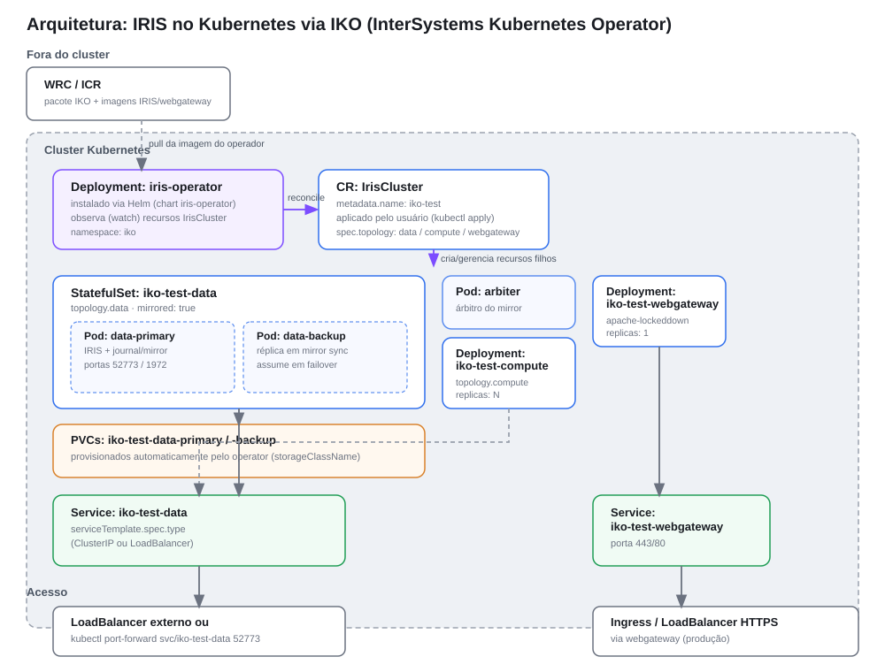
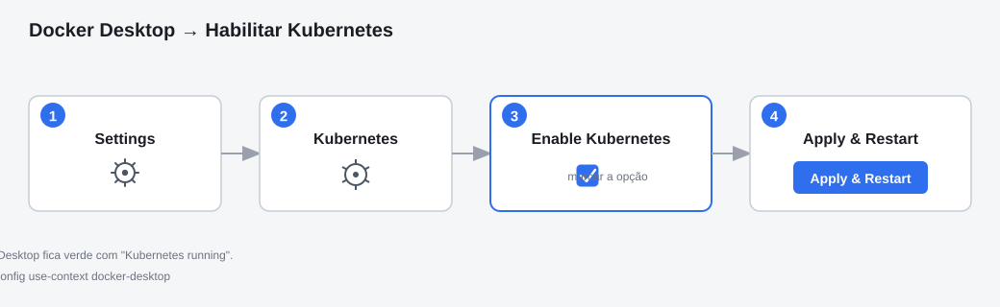
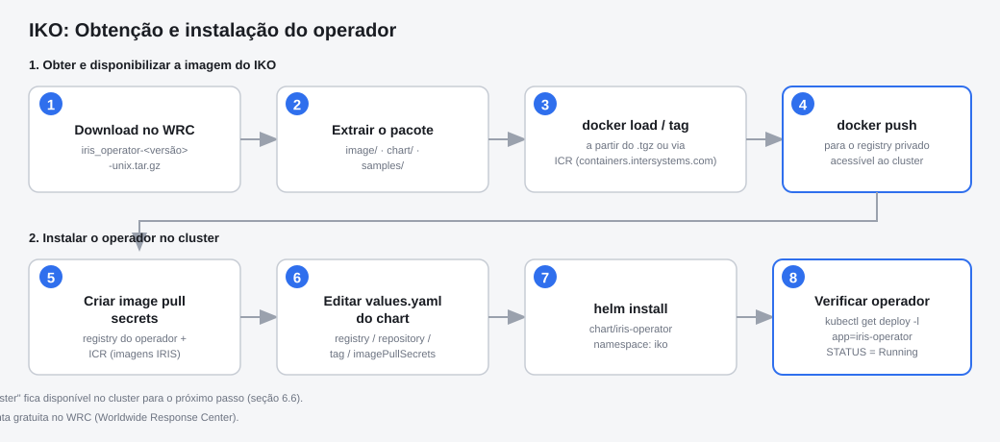
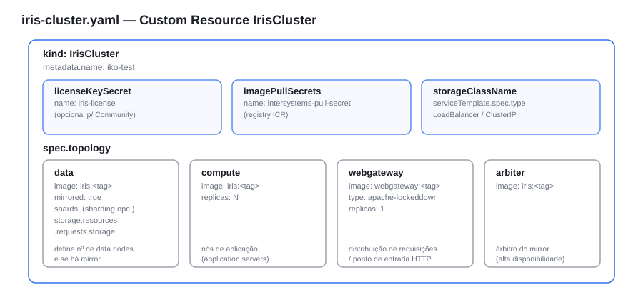

# Implantação do InterSystems IRIS em Kubernetes com IKO

**Documento de Arquitetura de Solução**

| | |
|---|---|
| **Rota** | 2 — IKO (InterSystems Kubernetes Operator) |
| **Escopo** | Ambientes que exigem automações de ciclo de vida (mirroring, sharding, scaling, backup) — dev avançado, homologação ou produção |
| **Imagem base** | `containers.intersystems.com/intersystems/iris:<versão>` (ICR — registry privado, requer conta WRC) |
| **Status** | Proposto — pendente de validação em ambiente com acesso a WRC/ICR |

---

## 1. Sumário Executivo

Este documento descreve a arquitetura e o procedimento para implantar o
InterSystems IRIS em um cluster Kubernetes utilizando o **IKO —
InterSystems Kubernetes Operator**, o operador oficial mantido pela
InterSystems. Diferentemente da Rota 1 (manifests nativos, sem operador),
esta rota delega ao IKO a criação e o gerenciamento do ciclo de vida dos
objetos Kubernetes (`StatefulSet`, `PersistentVolumeClaim`, `Service`) a
partir de um único Custom Resource (`IrisCluster`), obtendo em troca
automações como mirroring, sharding, scaling de nós de aplicação e
integração com backup — recursos não disponíveis na Rota 1 (ver seção
[7. Riscos e Limitações](#7-riscos-e-limitações) do documento da Rota 1).

Como contrapartida, esta rota introduz dependências adicionais: conta no
WRC (Worldwide Response Center) para obter o pacote do IKO, acesso a um
registry de imagens privado (ICR ou espelho próprio) e um processo de
instalação mais elaborado, via Helm.

## 2. Contexto e Objetivo

A Rota 1 remove barreiras de entrada ao usar apenas manifests padrão e a
imagem pública `iris-community`, mas abre mão das automações de ciclo de
vida do operador oficial — o que a torna inadequada para cenários que
precisem de alta disponibilidade (mirroring), escala horizontal
(sharding, compute nodes) ou operação continuada em produção.

Esta Rota 2 tem como objetivo cobrir exatamente essas lacunas, servindo de
caminho de evolução natural a partir da Rota 1: mesmo modelo mental de
Kubernetes (Deployment/StatefulSet, PVC, Service), porém com o operador
oficial assumindo a reconciliação do estado desejado, declarado em um
único Custom Resource.

## 3. Visão Geral da Arquitetura



A solução é composta por dois planos: o **plano de controle**, formado
pelo operador IKO (`Deployment` instalado via Helm) que observa recursos
do tipo `IrisCluster`; e o **plano de dados**, formado pelos objetos que o
operador cria automaticamente a partir de cada `IrisCluster` aplicado —
`StatefulSet` de nós de dados (com suporte a mirror primary/backup),
`Deployment` de nós de compute, `Deployment` do webgateway, `Pod` de
arbiter (quando mirrored), `PersistentVolumeClaim`s e `Service`s. O
usuário não cria esses objetos filhos diretamente: declara a topologia
desejada no `IrisCluster` e o operador reconcilia o estado do cluster para
correspondê-la.

## 4. Componentes da Solução

| Componente | Tipo (recurso K8s) | Responsabilidade |
|---|---|---|
| `iris-operator` | `Deployment` (instalado via Helm, chart `iris-operator`) | Observa recursos `IrisCluster` e reconcilia os objetos filhos (StatefulSet, PVC, Service) para o estado declarado. |
| `IrisCluster` (ex.: `iko-test`) | Custom Resource (`intersystems.com/v1alpha1`) | Declara a topologia do cluster IRIS: nós de dados (mirror/shards), compute, webgateway, arbiter, storage e imagens. |
| `iko-test-data` | `StatefulSet` (gerado pelo operador) | Gerencia o(s) Pod(s) de dados do IRIS; quando `mirrored: true`, mantém pares primary/backup com failover automático via arbiter. |
| `iko-test-compute` | `Deployment` (gerado pelo operador) | Nós de aplicação (application servers) que descarregam processamento do(s) nó(s) de dados; escaláveis via `replicas`. |
| `iko-test-webgateway` | `Deployment` (gerado pelo operador) | Servidor web (Apache) que distribui requisições entre os nós, ponto de entrada HTTP(S) recomendado para produção. |
| PVCs (gerados pelo operador) | `PersistentVolumeClaim` | Persistência dos dados de cada nó, dimensionada por `topology.data.storage`. |
| Services (gerados pelo operador) | `Service` (`ClusterIP` ou `LoadBalancer`, via `serviceTemplate`) | Roteamento de tráfego para os Pods de dados e webgateway. |

## 5. Pré-requisitos

- Um cluster Kubernetes (local ou gerenciado) na versão suportada pelo IKO
  (consultar a matriz de compatibilidade da versão do pacote baixado).
- `kubectl` instalado e configurado, apontando para o context correto —
  mesma verificação da Rota 1 (`kubectl get nodes`, com ao menos um node
  `Ready`; ver fluxo de habilitação do Kubernetes local abaixo, idêntico
  ao da Rota 1).

  

- **Helm 3** instalado (`helm version`). Se necessário, atualizar com:

  ```bash
  curl https://raw.githubusercontent.com/helm/helm/master/scripts/get-helm-3 | bash
  ```

- **Conta gratuita no WRC** (Worldwide Response Center), para baixar o
  pacote do IKO (ex.: `iris_operator-<versão>-unix.tar.gz`) e, se aplicável,
  autenticar no ICR para as imagens licenciadas do IRIS.
- Um **registry de imagens** acessível pelo cluster, para onde a imagem do
  operador (e opcionalmente a do IRIS) será disponibilizada — pode ser o
  próprio ICR (`containers.intersystems.com`) quando o cluster tiver saída
  para a internet, ou um registry privado da organização.
- Storage class configurada no cluster, para provisionamento dinâmico dos
  PVCs criados pelo operador.
- Arquivo de licença do IRIS (`iris.key`), obrigatório para topologias com
  IRIS licenciado; opcional ao usar a imagem `iris-community`.

## 6. Procedimento de Implantação



### 6.1 Obtenção do pacote IKO

Baixe o pacote do IKO na área de downloads do WRC (ex.:
`iris_operator-3.9.0.100-unix.tar.gz`) e extraia-o. O pacote contém:

- `image/` — arquivo da imagem do operador;
- `chart/iris-operator/` — chart Helm de instalação;
- `samples/` — manifests de exemplo, incluindo `iris-sample.yaml` com os
  campos disponíveis do `IrisCluster`;
- `README` com instruções específicas da versão.

### 6.2 Disponibilização da imagem do operador

Carregue e publique a imagem do operador em um registry acessível ao
cluster:

```bash
docker load -i iris_operator-<versao>/image/iris_operator-<versao>-docker.tgz
docker tag intersystems/iris-operator:<versao> docker.acme.com/kubernetes/intersystems-operator
docker login docker.acme.com
docker push docker.acme.com/kubernetes/intersystems-operator
```

Alternativamente, quando o cluster tiver saída para a internet, a imagem
pode ser consumida diretamente do ICR
(`containers.intersystems.com/iris-operator:<versão>`), dispensando o
`docker load`/`push`.

### 6.3 Criação dos secrets

Pull secret para o registry da imagem do operador (seção 6.2):

```bash
kubectl create secret docker-registry acme-pull-secret \
  --docker-server=https://docker.acme.com \
  --docker-username=***** \
  --docker-password='*****' \
  --docker-email=**********
```

Pull secret para as imagens do IRIS/webgateway, a partir do ICR:

```bash
kubectl create secret docker-registry intersystems-pull-secret \
  --docker-server=https://containers.intersystems.com \
  --docker-username=***** \
  --docker-password='*****' \
  --docker-email=**********
```

Secret com a licença do IRIS (opcional para `iris-community`):

```bash
kubectl create secret generic iris-license --from-file=iris.key
```

### 6.4 Instalação do operador via Helm

Ajuste `chart/iris-operator/values.yaml` (ou use o override
`iris-operator-values.yaml`, [Anexo A](#a1-iris-operator-valuesyaml))
apontando para a imagem publicada na seção 6.2 e para o pull secret criado
na seção 6.3. Em seguida instale o chart:

```bash
helm install intersystems iris_operator-<versao>/chart/iris-operator \
  --namespace iko --create-namespace \
  -f iris-operator-values.yaml
```

### 6.5 Verificação da instalação do operador

```bash
kubectl get deployments -n iko -l "release=intersystems, app=iris-operator" --watch
```

Aguarde o `STATUS` mudar para `Running`. Encerre o `--watch` com `Ctrl+C`
assim que estabilizar.

### 6.6 Definição do IrisCluster

Aplique o manifest `iris-cluster.yaml` (conteúdo completo no
[Anexo A](#a2-iris-clusteryaml)), que declara a topologia desejada:
1 nó de dados com mirror habilitado, 2 nós de compute e 1 réplica de
webgateway, referenciando os secrets criados na seção 6.3.



### 6.7 Aplicação do manifest

```bash
kubectl apply -f iris-cluster.yaml
```

### 6.8 Verificação da implantação

```bash
kubectl get iriscluster iko-test --watch
kubectl get pods -l "app.kubernetes.io/instance=iko-test" --watch
```

Aguarde os Pods de dados, compute e webgateway atingirem `STATUS =
Running` (pode levar alguns minutos, pois as imagens são baixadas e o
operador reconcilia a topologia em etapas). Encerre o `--watch` com
`Ctrl+C` assim que estabilizar.

### 6.9 Acesso ao ambiente

Se `serviceTemplate.spec.type` for `LoadBalancer` e o provedor do cluster
suportar (nuvem gerenciada, ou `MetalLB`/similar em cluster local):

```bash
kubectl get svc iko-test-data
```

Utilize o `EXTERNAL-IP` retornado. Alternativamente, em qualquer cluster
(inclusive local), via `port-forward`:

```bash
kubectl port-forward svc/iko-test-data 52773:52773 1972:1972
```

Management Portal:
[http://localhost:52773/csp/sys/%25CSP.Portal.Home.zen](http://localhost:52773/csp/sys/%25CSP.Portal.Home.zen)
(usuário `_SYSTEM`, senha `SYS`, com troca obrigatória no primeiro acesso,
salvo quando `spec.passwordHash` for definido no `IrisCluster`).

Terminal do IRIS (no Pod de dados primary):

```bash
kubectl exec -it iko-test-data-0 -- iris session iris
```

### 6.10 Habilitação de interoperabilidade

Procedimento idêntico ao da Rota 1: **System Administration →
Configuration → Namespaces** → crie um namespace marcando **"Enable
Namespace for interoperability"** (ou utilize o namespace `USER` padrão).
Em seguida, **Interoperability → List Productions → New** para criar a
primeira Production.


## 7. Riscos e Limitações

| Item | Situação nesta rota | Impacto |
|---|---|---|
| Alta disponibilidade | Suportada nativamente (`mirrored: true` + arbiter) | Failover automático entre data-primary e data-backup, ao custo de mais réplicas e um Pod de arbiter. |
| Automações de ciclo de vida | Fornecidas pelo IKO (mirroring, scaling de compute, integração com backup) | Reduz operação manual em relação à Rota 1, mas acopla a solução ao operador — upgrades do IRIS/operador devem seguir a matriz de compatibilidade do IKO. |
| Dependência de WRC/ICR | Obrigatória para obter o pacote do IKO e, tipicamente, as imagens do IRIS | Introduz barreira de entrada ausente na Rota 1; requer gestão de credenciais e, em ambientes fechados, um registry privado espelhando as imagens. |
| Complexidade operacional | Maior (Helm, CRDs, múltiplos secrets, reconciliação assíncrona) | Curva de aprendizado maior que a Rota 1; exige observabilidade sobre o próprio operador (logs, eventos do CR) para diagnosticar falhas de reconciliação. |
| Exposição de rede | `serviceTemplate` configurável (`ClusterIP` ou `LoadBalancer`) | Mais flexível que a Rota 1, mas exige que o cluster tenha um provedor de LoadBalancer (nuvem gerenciada ou `MetalLB`) para expor externamente sem `port-forward`. |
| Credenciais | `passwordHash` pode ser definido no CR; secrets de licença e pull ficam sob gestão do Kubernetes | Ainda requer estratégia de gerenciamento de segredos (ex.: External Secrets, Sealed Secrets) em ambientes reais. |
| Backup e disaster recovery | Mirroring cobre HA local; backup/DR entre clusters não é coberto por este documento | Requer estratégia dedicada, eventualmente combinada com os recursos do IKO Plus para gestão de banco. |
| Observabilidade | Não coberto por este documento | Requer integração com stack de monitoramento/logging do ambiente alvo, incluindo métricas/eventos do próprio operador. |

## 8. Troubleshooting

### 8.1 Operador não sobe (`ImagePullBackOff` no Pod do `iris-operator`)

**Causas mais comuns:**

- Imagem do operador não publicada no registry referenciado em
  `values.yaml` (seção 6.2), ou tag incorreta;
- `imagePullSecrets` ausente ou não referenciado no `values.yaml`;
- Credenciais do secret expiradas ou incorretas.

**Diagnóstico:**

```bash
kubectl describe pod -n iko -l app=iris-operator
```

Verifique o campo `Events` para a mensagem de erro específica do pull.

### 8.2 `error: the server doesn't have a resource type "IrisCluster"`

**Diagnóstico:** o CRD do `IrisCluster` ainda não foi registrado no
cluster — indica que a instalação via Helm (seção 6.4) não concluiu ou
falhou antes de aplicar os CRDs.

**Resolução:**

```bash
kubectl get crd | grep intersystems.com
helm status intersystems -n iko
```

Se o CRD não aparecer, reexecute a instalação do chart (seção 6.4) e
verifique os eventos do namespace `iko`.

### 8.3 `IrisCluster` aplicado, mas nenhum Pod é criado

**Causas mais comuns:**

- Operador não está `Running` (ver 8.1) — sem operador ativo, não há
  reconciliação;
- `licenseKeySecret` ou `imagePullSecrets` referenciados no
  `iris-cluster.yaml` não existem no namespace onde o CR foi aplicado;
- Ausência de storage class padrão, impedindo o provisionamento dos PVCs
  gerados pelo operador.

**Diagnóstico:**

```bash
kubectl describe iriscluster iko-test
kubectl get events --field-selector involvedObject.name=iko-test
kubectl logs -n iko deploy/intersystems-iris-operator
```

### 8.4 Pod de dados preso em `Pending` ou `CrashLoopBackOff`

Causas mais comuns:

- Falta de conectividade de saída do cluster para baixar a imagem do IRIS
  a partir do ICR;
- Licença inválida ou ausente para uma imagem não-Community
  (`iris.key` incorreto no secret `iris-license`);
- Recursos insuficientes (CPU/memória) no node para o(s) Pod(s) de dados.

### 8.5 Erro no `kubectl apply`/`helm install` por ausência de context

Mesmo diagnóstico e resolução da Rota 1 (seção 8.1 daquele documento):
confirme o context ativo com `kubectl config get-contexts` e
`kubectl cluster-info` antes de reexecutar os comandos desta seção.

## Anexo A — Manifests

### A.1 `iris-operator-values.yaml`

Override do `values.yaml` do chart Helm do operador, apontando para a
imagem publicada na seção 6.2 e para o pull secret da seção 6.3.

```yaml
operator:
  registry: docker.acme.com/kubernetes
  repository: intersystems-operator
  tag: latest

imagePullSecrets:
  - name: acme-pull-secret
```

### A.2 `iris-cluster.yaml`

Custom Resource `IrisCluster`, processado pelo IKO para criar e gerenciar
automaticamente o `StatefulSet` de dados (mirrored), os `Deployment`s de
compute e webgateway, PVCs e Services.

```yaml
apiVersion: intersystems.com/v1alpha1
kind: IrisCluster
metadata:
  name: iko-test
spec:
  licenseKeySecret:
    name: iris-license
  imagePullSecrets:
    - name: intersystems-pull-secret
  storageClassName: standard
  serviceTemplate:
    spec:
      type: LoadBalancer
  topology:
    data:
      image: containers.intersystems.com/intersystems/iris:2024.1.0.263.0
      mirrored: true
      storage:
        resources:
          requests:
            storage: 10Gi
    compute:
      image: containers.intersystems.com/intersystems/iris:2024.1.0.263.0
      replicas: 2
    webgateway:
      image: containers.intersystems.com/intersystems/webgateway:2024.1.0.263.0
      type: apache-lockeddown
      replicas: 1
```


## Referências

- [Using the InterSystems Kubernetes Operator — InterSystems Documentation](https://docs.intersystems.com/components/csp/docbook/DocBook.UI.Page.cls?KEY=AIKO)
- [InterSystems Kubernetes Operator Deep Dive: Part 2 — InterSystems Developer Community](https://community.intersystems.com/post/intersystems-kubernetes-operator-deep-dive-part-2)
- [IKO — Lessons Learned (Part 2 - The IrisCluster) — InterSystems Developer Community](https://community.intersystems.com/post/iko-lessons-learned-part-2-iriscluster)
- [iko-01-basic-iris-cluster — exemplos de uso do IKO (GitHub)](https://github.com/intersystems-community/iko-01-basic-iris-cluster)
- [InterSystems IRIS — Container Registry (ICR)](https://containers.intersystems.com)
- [Kubernetes — Custom Resources](https://kubernetes.io/docs/concepts/extend-kubernetes/api-extension/custom-resources/)
- [Helm — Documentação oficial](https://helm.sh/docs/)
