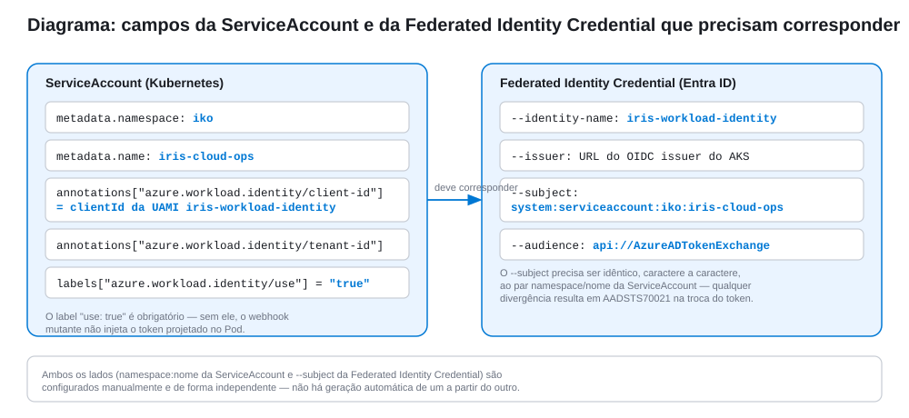
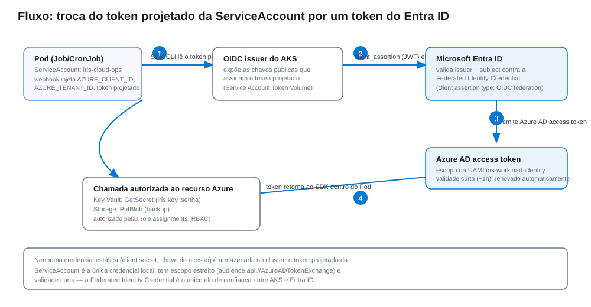

# Implantação do InterSystems IRIS em AKS com IAM via Workload Identity

**Documento de Arquitetura de Solução**

| | |
|---|---|
| **Rota** | 3 — AKS (Azure Kubernetes Service) + Microsoft Entra ID Workload Identity (IAM) |
| **Escopo** | Ambientes produtivos em nuvem que exigem eliminação de credenciais estáticas no acesso a Key Vault, Storage e ACR |
| **Imagem base** | `containers.intersystems.com/intersystems/iris:<versão>` (ICR, espelhada opcionalmente no ACR) |
| **Status** | Proposto — pendente de validação em ambiente AKS com permissões de Entra ID |

---

## 1. Sumário Executivo

Este documento descreve a arquitetura e o procedimento para implantar o
InterSystems IRIS em um cluster **AKS (Azure Kubernetes Service)**,
adicionando **IAM (Identity and Access Management)** nativo do Azure —
**Microsoft Entra ID Workload Identity** — para eliminar credenciais
estáticas (chaves de acesso, connection strings, service principal
secrets) no acesso a recursos de nuvem usados pela solução: **Azure Key
Vault** (licença do IRIS e senha administrativa), **Azure Storage** (destino
de backup) e **Azure Container Registry** (imagens).

Esta rota parte da Rota 2 (IKO) como base de implantação do IRIS em si —
o `IrisCluster` continua sendo gerenciado pelo operador exatamente como
descrito naquele documento — e adiciona uma camada de identidade federada
entre o cluster e o Entra ID, respondendo diretamente ao item "Credenciais"
listado na seção 7 (Riscos e Limitações) do documento da Rota 2: *"Ainda
requer estratégia de gerenciamento de segredos (...) em ambientes
reais."*

## 2. Contexto e Objetivo

Nas Rotas 1 e 2, segredos (licença, senha administrativa, pull secrets de
registry) são criados manualmente via `kubectl create secret`, a partir de
valores em texto plano fornecidos pelo operador humano no momento da
implantação — adequado para desenvolvimento e PoC, mas insuficiente em
produção, onde se espera que segredos de longa duração fiquem centralizados
em um cofre gerenciado (Key Vault), com acesso auditável e sem cópias em
texto plano circulando em pipelines ou estações de trabalho.

Esta Rota 3 tem como objetivo cobrir exatamente essa lacuna de **IAM**,
introduzindo o **Workload Identity** do AKS — a integração nativa entre o
Kubernetes e o Entra ID baseada em federação OIDC (`ServiceAccount Token
Volume Projection`) — para que cargas de trabalho dentro do cluster
obtenham tokens do Azure AD **sem nenhuma credencial estática armazenada
no cluster**, e usem esses tokens para ler segredos do Key Vault e gravar
backups no Storage, respeitando o princípio de menor privilégio via RBAC
do Azure.

## 3. Visão Geral da Arquitetura


A solução é composta por três camadas. A primeira, **fora do cluster**, no
Entra ID: uma **User-Assigned Managed Identity (UAMI)**, uma **Federated
Identity Credential** que estabelece a relação de confiança OIDC com o
cluster, e **atribuições RBAC do Azure** concedendo à UAMI acesso mínimo ao
Key Vault e ao Storage Account. A segunda, os **recursos Azure** em si (Key
Vault, Storage Account, ACR). A terceira, **dentro do cluster AKS**: uma
`ServiceAccount` anotada com o `clientId` da UAMI, um `Job` de bootstrap que
materializa segredos nativos do Kubernetes a partir do Key Vault, um
`CronJob` de backup que grava no Storage Account, e o `IrisCluster` (IKO,
Rota 2) consumindo esses segredos exatamente como já fazia antes — sem
nenhuma alteração no operador ou no CRD.

O pull de imagens do ACR pelos nós do cluster usa um mecanismo de IAM
**diferente e complementar**: a **identidade do kubelet** (identidade do
próprio node pool do AKS), anexada ao ACR via `az aks update --attach-acr`.
Este documento trata os dois mecanismos separadamente para evitar confusão:
Workload Identity é IAM **em nível de Pod** (usado pelos Jobs); a
identidade do kubelet é IAM **em nível de nó** (usado pelo `kubelet` para
pull de imagem).

## 4. Componentes da Solução

| Componente | Tipo | Responsabilidade |
|---|---|---|
| AKS cluster | Cluster gerenciado, com `--enable-oidc-issuer --enable-workload-identity` | Expõe um emissor OIDC público e injeta, via *mutating webhook*, o token projetado da ServiceAccount nos Pods rotulados. |
| `iris-workload-identity` | User-Assigned Managed Identity (Entra ID) | Identidade do Azure usada pelos Jobs dentro do cluster; alvo das atribuições RBAC. |
| Federated Identity Credential | Recurso do Entra ID, vinculado à UAMI | Relação de confiança entre o emissor OIDC do AKS e a UAMI, restrita a um `subject` (`namespace:serviceaccount`) específico. |
| `iris-cloud-ops` | `ServiceAccount` (Kubernetes, namespace `iko`) | Anotada com `azure.workload.identity/client-id`; usada pelos Jobs/CronJobs que precisam de acesso a recursos Azure. |
| `iris-secrets-bootstrap` | `Job` | Lê `iris-license` e `iris-admin-password` do Key Vault e os materializa como `Secret`s nativos do Kubernetes, consumidos pelo `IrisCluster`. |
| `iris-backup-to-blob` | `CronJob` | Executa backup externo do IRIS e o envia ao Storage Account autenticado via token do Entra ID (sem chave de acesso/SAS). |
| `iris-kv` | Azure Key Vault (RBAC authorization) | Cofre dos segredos de longa duração: licença do IRIS e senha administrativa. |
| `irisbackups` | Azure Storage Account (container `backups`) | Destino dos backups, acessado via `Storage Blob Data Contributor`. |
| ACR | Azure Container Registry | Registro de imagens, anexado ao cluster via identidade do kubelet (`--attach-acr`), independente do Workload Identity. |
| `IrisCluster` (Rota 2) | Custom Resource do IKO | Reaproveitado sem alterações no CRD; consome os `Secret`s materializados pelo Job de bootstrap. |

## 5. Pré-requisitos

- Cluster **AKS** existente (ou a criar) e Azure CLI (`az`) autenticado com
  permissão para: atualizar o cluster, criar identidades gerenciadas,
  criar federated credentials e criar atribuições de papel (RBAC) no
  Entra ID e nos recursos-alvo.
- **Rota 2 concluída** neste cluster (IKO instalado, `IrisCluster`
  aplicado) — esta rota não substitui a Rota 2, ela adiciona IAM sobre a
  implantação já existente.
- **Azure Key Vault** provisionado com autorização por RBAC habilitada
  (`--enable-rbac-authorization`), contendo (ou a receber) os segredos
  `iris-license` (conteúdo do `iris.key` em base64) e
  `iris-admin-password`.
- **Storage Account** com um container de blobs (`backups`) para destino
  do backup.
- **Azure Container Registry**, quando as imagens do IRIS/webgateway forem
  espelhadas para dentro do tenant em vez de consumidas diretamente do
  ICR.
- `kubectl` configurado (`az aks get-credentials`) apontando para o
  cluster correto.

Confirme os pré-requisitos com:

```bash
az account show
kubectl config current-context
kubectl get iriscluster -n iko
```

O último comando deve listar o `IrisCluster` da Rota 2 já em execução.

## 6. Procedimento de Implantação

O script completo dos comandos `az` desta seção está consolidado no
[Anexo B](#anexo-b--provisionamento-azure).

### 6.1 Habilitação de OIDC issuer e Workload Identity no AKS

```bash
az aks update \
  --resource-group rg-iris \
  --name aks-iris \
  --enable-oidc-issuer \
  --enable-workload-identity
```

Clusters criados a partir de agora podem receber as mesmas flags já em
`az aks create`.

### 6.2 Obtenção da URL do emissor OIDC

```bash
AKS_OIDC_ISSUER=$(az aks show \
  --resource-group rg-iris --name aks-iris \
  --query "oidcIssuerProfile.issuerUrl" -o tsv)
```

Este valor é público (não é segredo) e é usado na seção 6.5 para
estabelecer a relação de confiança no Entra ID.

### 6.3 Criação da Managed Identity

```bash
az identity create --resource-group rg-iris \
  --name iris-workload-identity --location brazilsouth

UAMI_CLIENT_ID=$(az identity show --resource-group rg-iris \
  --name iris-workload-identity --query clientId -o tsv)
```

### 6.4 Criação da ServiceAccount no cluster

Aplique o manifest `iris-serviceaccount.yaml` ([Anexo A](#a1-iris-serviceaccountyaml)),
substituindo `<UAMI_CLIENT_ID>` e `<AZURE_TENANT_ID>` pelos valores obtidos
na seção 6.3:

```bash
kubectl apply -f iris-serviceaccount.yaml
```



### 6.5 Criação da Federated Identity Credential

```bash
az identity federated-credential create \
  --name iris-cloud-ops-federation \
  --identity-name iris-workload-identity \
  --resource-group rg-iris \
  --issuer "$AKS_OIDC_ISSUER" \
  --subject "system:serviceaccount:iko:iris-cloud-ops" \
  --audience "api://AzureADTokenExchange"
```

O valor de `--subject` deve corresponder, caractere a caractere, ao par
`namespace:nome` da `ServiceAccount` criada na seção 6.4 — ver diagrama
acima e a seção [8.2](#82-erro-aadsts70021-no-token-exchange).

### 6.6 Atribuições RBAC no Azure

```bash
az role assignment create \
  --assignee-object-id "$(az identity show -g rg-iris -n iris-workload-identity --query principalId -o tsv)" \
  --assignee-principal-type ServicePrincipal \
  --role "Key Vault Secrets User" \
  --scope "$(az keyvault show --name iris-kv --query id -o tsv)"

az role assignment create \
  --assignee-object-id "$(az identity show -g rg-iris -n iris-workload-identity --query principalId -o tsv)" \
  --assignee-principal-type ServicePrincipal \
  --role "Storage Blob Data Contributor" \
  --scope "$(az storage account show --name irisbackups --query id -o tsv)"
```

Escopo em nível de recurso (não de resource group), seguindo o princípio
de menor privilégio.

### 6.7 RBAC interno ao cluster para o Job/CronJob

Aplique `iris-cloud-ops-rbac.yaml` ([Anexo A](#a4-iris-cloud-ops-rbacyaml)),
que concede à `ServiceAccount iris-cloud-ops` apenas as permissões
necessárias para criar/atualizar `Secret`s e executar `exec` nos Pods de
dados (usado pelo backup, seção 6.9):

```bash
kubectl apply -f iris-cloud-ops-rbac.yaml
```

### 6.8 Publicação dos segredos de longa duração no Key Vault

```bash
az keyvault secret set --vault-name iris-kv --name iris-license \
  --file <(base64 -w0 iris.key)
az keyvault secret set --vault-name iris-kv --name iris-admin-password \
  --value '<senha-forte>'
```

A partir deste ponto, o `iris.key` e a senha administrativa deixam de
circular como argumentos de `kubectl create secret` — o único lugar onde
existem em texto plano fora do Key Vault é o terminal usado para este
`set` inicial.

### 6.9 Execução do Job de bootstrap de segredos

Aplique `iris-secrets-bootstrap-job.yaml` ([Anexo A](#a2-iris-secrets-bootstrap-jobyaml)):

```bash
kubectl apply -f iris-secrets-bootstrap-job.yaml
kubectl get pods -n iko -l job-name=iris-secrets-bootstrap --watch
```

O Job usa a `ServiceAccount iris-cloud-ops` (federada com a UAMI) para
autenticar no Entra ID, ler os segredos do Key Vault e materializá-los como
`Secret`s nativos (`iris-license`, `iris-admin-password`) no namespace
`iko` — os mesmos nomes já referenciados pelo `IrisCluster` da Rota 2
(`spec.licenseKeySecret`).

### 6.10 Agendamento do backup para o Storage Account

Aplique `iris-backup-cronjob.yaml` ([Anexo A](#a3-iris-backup-cronjobyaml)):

```bash
kubectl apply -f iris-backup-cronjob.yaml
```

O `CronJob` executa diariamente, aciona `Backup.General` no nó de dados
via `kubectl exec`, empacota o diretório durável e envia o resultado ao
container `backups` do Storage Account com `azcopy login --identity`,
autenticado pela mesma `ServiceAccount` federada — sem chave de acesso
nem SAS token armazenados no cluster.

### 6.11 Anexação do ACR ao cluster (IAM em nível de nó)

```bash
az aks update --resource-group rg-iris --name aks-iris \
  --attach-acr acriris
```

Concede `AcrPull` à identidade do kubelet do node pool — mecanismo
independente do Workload Identity, usado exclusivamente para pull de
imagem (seção 3).

### 6.12 Verificação ponta a ponta

```bash
kubectl logs -n iko job/iris-secrets-bootstrap
kubectl get secret iris-license iris-admin-password -n iko
kubectl get cronjob iris-backup-to-blob -n iko
kubectl create job --from=cronjob/iris-backup-to-blob -n iko iris-backup-manual-test
kubectl logs -n iko job/iris-backup-manual-test --follow
```

O log do Job de teste deve mostrar o `azcopy login --identity` seguido do
upload bem-sucedido do arquivo de backup.

### 6.13 Habilitação de interoperabilidade

Procedimento idêntico ao das Rotas 1 e 2: **System Administration →
Configuration → Namespaces** → habilite um namespace para
interoperabilidade e crie a primeira Production em **Interoperability →
List Productions → New**.


## 7. Riscos e Limitações

| Item | Situação nesta rota | Impacto |
|---|---|---|
| Credenciais estáticas | Eliminadas para acesso a Key Vault, Storage e (opcionalmente) ACR | O único artefato local de curta duração é o token projetado da ServiceAccount (~1h, renovado automaticamente); nenhuma chave de longa duração é armazenada no cluster. |
| Compatibilidade com o CRD do IKO | O `IrisCluster` não foi alterado — os Pods de dados/compute/webgateway continuam com a ServiceAccount padrão do IKO, sem Workload Identity direto | O Workload Identity cobre os Jobs auxiliares (bootstrap e backup), não os Pods do próprio IRIS; ver nota abaixo sobre evolução futura. |
| Dependência de versão do IKO | Algumas versões do IKO expõem `serviceAccountName` por componente da topologia, permitindo montar segredos do Key Vault diretamente nos Pods de dados via CSI Secrets Store driver | Quando disponível, essa é uma evolução natural desta rota — validar na documentação da versão do IKO utilizada antes de adotar; não coberto neste documento. |
| Propagação da Federated Identity Credential | Pode levar alguns minutos para ser reconhecida pelo Entra ID após a criação | Primeira execução do Job de bootstrap logo após a seção 6.5 pode falhar com `AADSTS70021`; reexecutar após alguns minutos resolve. |
| Escopo do RBAC interno ao cluster | `iris-cloud-ops` tem permissão de `pods/exec` no namespace `iko`, usada pelo backup | Deve ser revisado em ambientes com múltiplos times no mesmo namespace; considerar namespace dedicado para os Jobs de IAM. |
| Backup | Cobre o envio ao Storage; a estratégia de retenção, versionamento e teste de restauração do backup não é coberta por este documento | Requer política dedicada de ciclo de vida do container `backups` (Azure Blob lifecycle management) e testes periódicos de restore. |
| Observabilidade | Não coberto por este documento | Requer integração com Azure Monitor/Log Analytics, incluindo logs de auditoria do Entra ID (Sign-in logs da UAMI) para rastrear o uso da identidade federada. |
| Imagens do IRIS | ACR usado apenas se as imagens forem espelhadas do ICR; caso contrário, o pull secret do ICR (Rota 2, seção 6.3) continua necessário | Mistura de mecanismos de IAM (kubelet identity para ACR, pull secret estático para ICR) é aceitável, mas deve ser documentada operacionalmente. |

## 8. Troubleshooting

### 8.1 Job de bootstrap falha com `DefaultAzureCredential failed to retrieve a token` (ou equivalente)

**Causas mais comuns:**

- O Pod não tem o label `azure.workload.identity/use: "true"` — sem ele, o
  *webhook* mutante não injeta `AZURE_CLIENT_ID`, `AZURE_TENANT_ID` e o
  volume do token projetado;
- `serviceAccountName` do Pod não é `iris-cloud-ops` (ou diverge do nome
  usado na Federated Identity Credential);
- Workload Identity não está habilitado no cluster (seção 6.1 não
  aplicada).

**Diagnóstico:**

```bash
kubectl get pod -n iko -l job-name=iris-secrets-bootstrap -o yaml | grep -A3 "azure.workload.identity"
kubectl describe pod -n iko -l job-name=iris-secrets-bootstrap
```

Confirme a presença das variáveis `AZURE_CLIENT_ID`, `AZURE_TENANT_ID` e
`AZURE_FEDERATED_TOKEN_FILE` no container.

### 8.2 Erro `AADSTS70021` no token exchange

**Diagnóstico:** o `subject` da Federated Identity Credential não
corresponde exatamente a `system:serviceaccount:<namespace>:<nome>` da
ServiceAccount usada pelo Pod — ver o diagrama da seção 6.4.

**Resolução:**

```bash
az identity federated-credential list \
  --identity-name iris-workload-identity --resource-group rg-iris \
  --query "[].{name:name, subject:subject, issuer:issuer}"
```

Compare o `subject` retornado com:

```bash
kubectl get job iris-secrets-bootstrap -n iko \
  -o jsonpath='{.spec.template.spec.serviceAccountName}'
```

Se a credencial foi criada há poucos minutos, aguarde a propagação
(seção 7, linha "Propagação da Federated Identity Credential") antes de
reexecutar.

### 8.3 `az keyvault secret show` retorna `Forbidden`/`403`

**Causas mais comuns:**

- Atribuição de papel (seção 6.6) não foi criada, ou foi criada no escopo
  errado (resource group em vez do Key Vault específico);
- Key Vault não está com `--enable-rbac-authorization`, ainda usando o
  modelo legado de *access policies* (incompatível com Workload
  Identity + RBAC).

**Diagnóstico:**

```bash
az keyvault show --name iris-kv --query "properties.enableRbacAuthorization"
az role assignment list --scope "$(az keyvault show --name iris-kv --query id -o tsv)"
```

### 8.4 `IrisCluster` não sobe após o Job de bootstrap

**Diagnóstico:** os `Secret`s materializados (seção 6.9) precisam ter os
mesmos nomes já referenciados em `spec.licenseKeySecret`/
`spec.imagePullSecrets` do `IrisCluster` da Rota 2.

```bash
kubectl get secret iris-license iris-admin-password -n iko
kubectl describe iriscluster iko-test -n iko
```

Se os nomes divergirem, ajuste o `IrisCluster` ou o `Job` de bootstrap
para usar a mesma nomenclatura — este documento assume que ambos
compartilham os nomes `iris-license`/`iris-admin-password`.

### 8.5 `azcopy login --identity` falha no CronJob de backup

**Causas mais comuns:**

- `AZURE_CLIENT_ID` não propagado para o container do backup — confirme o
  label `azure.workload.identity/use: "true"` no `jobTemplate.spec.template.metadata.labels`
  do `CronJob` (não apenas no `Job` de bootstrap);
- Atribuição `Storage Blob Data Contributor` (seção 6.6) ausente ou em
  escopo incorreto.

**Diagnóstico:**

```bash
kubectl create job --from=cronjob/iris-backup-to-blob -n iko iris-backup-debug
kubectl logs -n iko job/iris-backup-debug
```

## Anexo A — Manifests Kubernetes

### A.1 `iris-serviceaccount.yaml`

`ServiceAccount` federada com a Managed Identity do Azure, usada por todos
os Jobs/CronJobs desta rota que precisam de acesso a recursos Azure.

```yaml
apiVersion: v1
kind: ServiceAccount
metadata:
  name: iris-cloud-ops
  namespace: iko
  annotations:
    azure.workload.identity/client-id: "<UAMI_CLIENT_ID>"
    azure.workload.identity/tenant-id: "<AZURE_TENANT_ID>"
  labels:
    azure.workload.identity/use: "true"
```

### A.2 `iris-secrets-bootstrap-job.yaml`

`Job` que lê os segredos de longa duração do Key Vault e os materializa
como `Secret`s nativos do Kubernetes, consumidos pelo `IrisCluster` (Rota
2) sem alterações no CRD do IKO.

```yaml
apiVersion: batch/v1
kind: Job
metadata:
  name: iris-secrets-bootstrap
  namespace: iko
spec:
  backoffLimit: 2
  template:
    metadata:
      labels:
        azure.workload.identity/use: "true"
    spec:
      serviceAccountName: iris-cloud-ops
      restartPolicy: Never
      containers:
        - name: bootstrap
          # imagem ilustrativa: combine az-cli + kubectl em uma imagem própria
          # (mcr.microsoft.com/azure-cli não inclui kubectl por padrão)
          image: <registry>/iris-cloud-ops-toolbox:latest
          env:
            - name: KEY_VAULT_NAME
              value: iris-kv
          command:
            - /bin/sh
            - -c
            - |
              set -e
              az login --federated-token "$(cat $AZURE_FEDERATED_TOKEN_FILE)" \
                --service-principal -u "$AZURE_CLIENT_ID" -t "$AZURE_TENANT_ID"

              LICENSE_B64=$(az keyvault secret show --vault-name "$KEY_VAULT_NAME" \
                --name iris-license --query value -o tsv)
              ADMIN_PASSWORD=$(az keyvault secret show --vault-name "$KEY_VAULT_NAME" \
                --name iris-admin-password --query value -o tsv)

              echo "$LICENSE_B64" | base64 -d > /tmp/iris.key

              kubectl create secret generic iris-license \
                --from-file=iris.key=/tmp/iris.key \
                --namespace iko --dry-run=client -o yaml | kubectl apply -f -

              kubectl create secret generic iris-admin-password \
                --from-literal=password="$ADMIN_PASSWORD" \
                --namespace iko --dry-run=client -o yaml | kubectl apply -f -
```

### A.3 `iris-backup-cronjob.yaml`

`CronJob` diário que executa backup externo do IRIS e o envia ao Storage
Account autenticado via Workload Identity.

```yaml
apiVersion: batch/v1
kind: CronJob
metadata:
  name: iris-backup-to-blob
  namespace: iko
spec:
  schedule: "0 2 * * *"
  jobTemplate:
    spec:
      backoffLimit: 1
      template:
        metadata:
          labels:
            azure.workload.identity/use: "true"
        spec:
          serviceAccountName: iris-cloud-ops
          restartPolicy: Never
          containers:
            - name: backup
              # imagem ilustrativa: combine azcopy + iris CLI/client em uma imagem própria
              image: <registry>/iris-cloud-ops-toolbox:latest
              env:
                - name: STORAGE_ACCOUNT
                  value: irisbackups
                - name: STORAGE_CONTAINER
                  value: backups
              command:
                - /bin/sh
                - -c
                - |
                  set -e
                  kubectl exec iko-test-data-0 -n iko -- iris session iris -U "%SYS" \
                    "##class(Backup.General).ExternalFreeze()"

                  BACKUP_FILE="/tmp/iris-backup-$(date +%Y%m%d%H%M%S).tar.gz"
                  kubectl exec iko-test-data-0 -n iko -- tar czf - /durable/irissys \
                    > "$BACKUP_FILE"

                  kubectl exec iko-test-data-0 -n iko -- iris session iris -U "%SYS" \
                    "##class(Backup.General).ExternalThaw()"

                  azcopy login --identity --identity-client-id "$AZURE_CLIENT_ID"
                  azcopy copy "$BACKUP_FILE" \
                    "https://${STORAGE_ACCOUNT}.blob.core.windows.net/${STORAGE_CONTAINER}/$(basename "$BACKUP_FILE")"
```

### A.4 `iris-cloud-ops-rbac.yaml`

`Role`/`RoleBinding` com o escopo mínimo necessário, dentro do cluster,
para os Jobs desta rota (criação de `Secret`s e `exec` nos Pods de dados
para o backup).

```yaml
apiVersion: rbac.authorization.k8s.io/v1
kind: Role
metadata:
  name: iris-secrets-writer
  namespace: iko
rules:
  - apiGroups: [""]
    resources: ["secrets"]
    verbs: ["get", "create", "update", "patch"]
  - apiGroups: [""]
    resources: ["pods", "pods/exec"]
    verbs: ["get", "list", "create"]
---
apiVersion: rbac.authorization.k8s.io/v1
kind: RoleBinding
metadata:
  name: iris-cloud-ops-secrets-writer
  namespace: iko
subjects:
  - kind: ServiceAccount
    name: iris-cloud-ops
    namespace: iko
roleRef:
  kind: Role
  name: iris-secrets-writer
  apiGroup: rbac.authorization.k8s.io
```




## Anexo B — Provisionamento Azure

Script consolidado com todos os comandos `az` das seções 6.1 a 6.6 e 6.11:
[`azure-workload-identity-setup.sh`](azure-workload-identity-setup.sh).

## Referências

- [Workload Identity federation — Microsoft Entra ID Documentation](https://learn.microsoft.com/en-us/entra/workload-id/workload-identity-federation)
- [Use Microsoft Entra Workload ID with Azure Kubernetes Service (AKS)](https://learn.microsoft.com/en-us/azure/aks/workload-identity-overview)
- [Deploy and configure workload identity on an AKS cluster](https://learn.microsoft.com/en-us/azure/aks/workload-identity-deploy-cluster)
- [Provide an access token for authentication (Azure Key Vault, RBAC)](https://learn.microsoft.com/en-us/azure/key-vault/general/rbac-guide)
- [Authorize access to blobs using Microsoft Entra ID](https://learn.microsoft.com/en-us/azure/storage/blobs/authorize-access-azure-active-directory)
- [Authenticate with Azure Container Registry from Azure Kubernetes Service](https://learn.microsoft.com/en-us/azure/aks/cluster-container-registry-integration)
- [AzCopy — authorize with Microsoft Entra ID](https://learn.microsoft.com/en-us/azure/storage/common/storage-use-azcopy-authorize-azure-active-directory)
- Documento da Rota 2 — `IRIS-Kubernetes-IKO-Arquitetura-Solucao.md` (base de implantação do IRIS via IKO, reaproveitada nesta rota)
