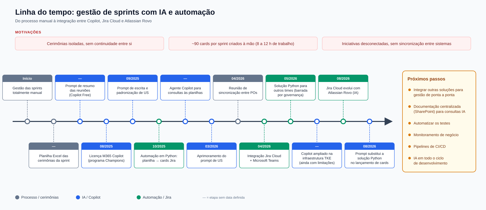
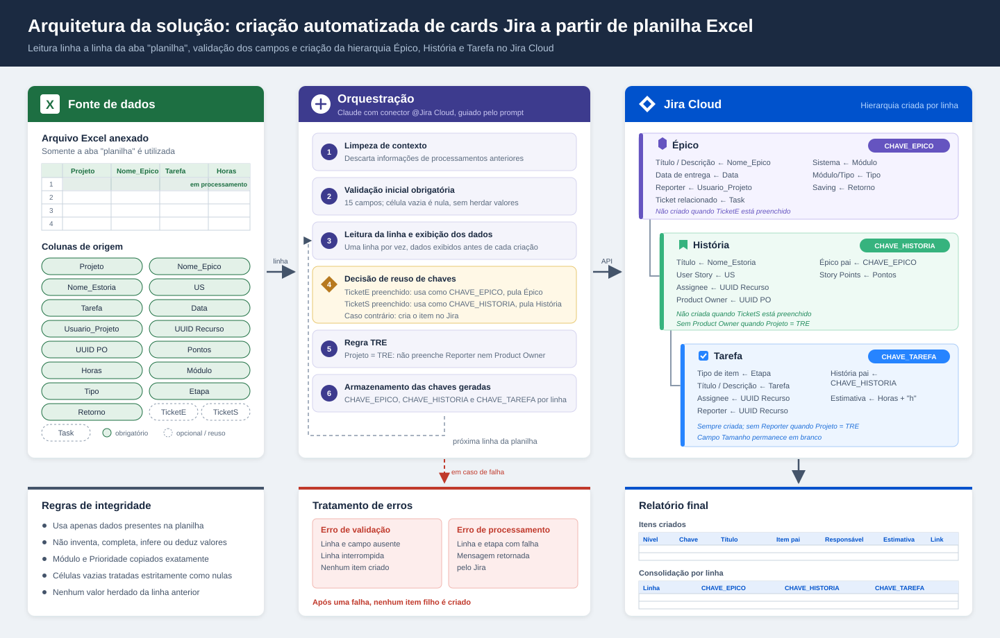

# Gestão de sprints com IA e automação no Jira

Este documento reúne a evolução da gestão de sprints do time: o processo, que começou manual, passou a usar Copilot, Jira Cloud e Atlassian Rovo. Ele também descreve a arquitetura da criação automatizada de cards a partir de planilha Excel e o diagnóstico atual do processo ágil.

## Sumário

- [1. Motivações](#1-motivações)
- [2. Linha do tempo](#2-linha-do-tempo)
- [3. Arquitetura: cards Jira a partir de planilha Excel](#3-arquitetura-cards-jira-a-partir-de-planilha-excel)
- [4. Diagnóstico do processo ágil](#4-diagnóstico-do-processo-ágil)
- [5. Próximos passos](#5-próximos-passos)
- [Arquivos de origem](#arquivos-de-origem)

---

## 1. Motivações

- Cerimônias isoladas, sem continuidade entre si.
- Cerca de **90 cards por sprint** criados e geridos à mão, o que consumia **de 8 a 12 horas** de trabalho.
- Iniciativas desconectadas, sem sincronização entre os sistemas.

## 2. Linha do tempo

| Data | Marco | Frente |
|---|---|---|
| Início | Gestão das sprints feita de forma totalmente manual | Processo |
| — | Planilha Excel para acompanhar as cerimônias da sprint (retrospectiva, refinamento, planning e review) | Processo |
| — | Prompt para automatizar o resumo das reuniões (Copilot Free) | IA |
| 08/2025 | Licença do Microsoft 365 Copilot liberada pelo programa Champions | IA |
| 09/2025 | Prompt para escrever e padronizar User Stories (US) | IA |
| 10/2025 | Início da automação em Python: lançamento de cards no Jira a partir da planilha | Automação |
| — | Agente Copilot para consultas às planilhas | IA |
| 03/2026 | Aprimoramento do prompt de padronização de User Stories | IA |
| 04/2026 | Reunião de sincronização entre POs | Processo |
| 04/2026 | Atlassian disponibiliza a integração entre Jira Cloud e Microsoft Teams | Automação |
| 05/2026 | Tentativa de levar a solução Python a outros times, barrada por questões de governança | Automação |
| — | Copilot ampliado na infraestrutura da TKE, ainda com limitações | IA |
| 08/2026 | Jira Cloud evolui com o Atlassian Rovo (IA), que melhora a criação e a alteração de cards | Automação |
| 08/2026 | Prompt substitui a solução Python no lançamento de cards | IA / Automação |

> "—" indica etapa sem data definida.

## 3. Arquitetura: cards Jira a partir de planilha Excel

A solução lê a aba **"planilha"** do Excel anexado, uma linha por vez, valida os campos e cria no Jira Cloud a hierarquia **Épico → História → Tarefa**. A orquestração é feita pelo Claude com o conector **@Jira Cloud**, guiado por um prompt.

### 3.1 Colunas de origem

`Projeto`, `Nome_Epico`, `Nome_Estoria`, `US`, `Tarefa`, `Data`, `Usuario_Projeto`, `UUID Recurso`, `UUID PO`, `Pontos`, `Horas`, `Módulo`, `Tipo`, `Etapa`, `Retorno`, `TicketE`, `TicketS`, `Task`.

`TicketE` e `TicketS` são opcionais e servem para reaproveitar um Épico ou uma História que já existe.

### 3.2 Fluxo de processamento

1. **Limpeza de contexto:** descarta as informações de processamentos anteriores.
2. **Validação inicial obrigatória:** confere 15 campos. Célula vazia é tratada como nula e não herda valores.
3. **Leitura da linha:** processa uma linha por vez e exibe os dados antes de cada criação.
4. **Reuso de chaves:**
   - `TicketE` preenchido: usa o valor como `CHAVE_EPICO` e não cria o Épico.
   - `TicketS` preenchido: usa o valor como `CHAVE_HISTORIA` e não cria a História.
   - Caso contrário, cria o item no Jira.
5. **Regra TRE:** quando `Projeto = TRE`, não preenche Reporter nem Product Owner.
6. **Armazenamento:** guarda `CHAVE_EPICO`, `CHAVE_HISTORIA` e `CHAVE_TAREFA` de cada linha e passa para a próxima.

### 3.3 Mapeamento de campos

| Item | Campo no Jira ← coluna da planilha | Observações |
|---|---|---|
| **Épico** | Título / Descrição ← `Nome_Epico` Data de entrega ← `Data` Reporter ← `Usuario_Projeto` Ticket relacionado ← `Task` Sistema ← `Módulo` Módulo/Tipo ← `Tipo` Saving ← `Retorno` | Não é criado quando `TicketE` está preenchido |
| **História** | Título ← `Nome_Estoria` User Story ← `US` Assignee ← `UUID Recurso` Product Owner ← `UUID PO` Épico pai ← `CHAVE_EPICO` Story Points ← `Pontos` | Não é criada quando `TicketS` está preenchido; sem Product Owner quando `Projeto = TRE` |
| **Tarefa** | Tipo de item ← `Etapa` Título / Descrição ← `Tarefa` Assignee ← `UUID Recurso` Reporter ← `UUID Recurso` História pai ← `CHAVE_HISTORIA` Estimativa ← `Horas` + "h" | Sempre criada; sem Reporter quando `Projeto = TRE`; o campo Tamanho fica em branco |

### 3.4 Regras de integridade

- Usa apenas dados presentes na planilha.
- Não inventa, completa, infere nem deduz valores.
- Copia Módulo e Prioridade exatamente como estão.
- Trata células vazias estritamente como nulas.
- Não herda nenhum valor da linha anterior.

### 3.5 Tratamento de erros

| Tipo | O que é informado | Efeito |
|---|---|---|
| Erro de validação | Linha e campo ausente | A linha é interrompida e nenhum item é criado |
| Erro de processamento | Linha, etapa com falha e mensagem retornada pelo Jira | Após a falha, nenhum item filho é criado |

### 3.6 Relatório final

- **Itens criados:** nível, chave, título, item pai, responsável, estimativa e link.
- **Consolidação por linha:** linha, `CHAVE_EPICO`, `CHAVE_HISTORIA` e `CHAVE_TAREFA`.

## 4. Diagnóstico do processo ágil

Os fatores que comprometem a previsibilidade e a qualidade das entregas estão organizados em cinco eixos. O de maior impacto hoje é a **divisão de capacidade entre sprints e projetos**.

### 4.1 Planejamento e escopo

| # | Problema | Recomendação |
|---|---|---|
| 1.1 | **Comprometimento acima da capacidade:** o time assume mais itens do que consegue entregar | Planejar pela média de entrega das últimas sprints e reservar margem para imprevistos |
| 1.2 | **Itens grandes ou pouco detalhados:** sem critérios de aceite ou maiores que uma sprint | Refinar o backlog continuamente e dividir as demandas em entregas menores (critério INVEST) |
| 1.3 | **Alteração de escopo durante a sprint:** urgências incluídas sem negociação | O PO protege o escopo; ao incluir uma urgência, retira um item de esforço equivalente |
| 1.4 | **Sprint sem objetivo claro:** vira uma lista de tarefas desconectadas | Definir em cada planejamento um objetivo de negócio claro e mensurável |

### 4.2 Execução

| # | Problema | Recomendação |
|---|---|---|
| 2.1 | **Excesso de trabalho simultâneo:** as entregas se acumulam no último dia | Limitar os itens em andamento por pessoa e concluir antes de começar outro |
| 2.2 | **Critério de conclusão insuficiente:** itens voltam como retrabalho ou defeito | Formalizar uma Definição de Pronto com, no mínimo, teste, revisão e documentação |
| 2.3 | **Dependências externas:** bloqueios por outras áreas, fornecedores ou aprovações | Mapear as dependências no refinamento e tratar os impedimentos na hora, escalando se preciso |
| 2.4 | **Testes concentrados no final:** a área de qualidade vira gargalo | Distribuir os testes ao longo da sprint e ampliar a automação |

### 4.3 Cerimônias e papéis

| # | Problema | Recomendação |
|---|---|---|
| 3.1 | **Daily como prestação de contas** à gestão | Reunião curta, focada em impedimentos e no progresso rumo à meta |
| 3.2 | **Retrospectivas sem desdobramento prático:** os problemas se repetem | Encerrar com uma ou duas ações concretas, com responsável, e verificá-las na retrospectiva seguinte |
| 3.3 | **PO ausente ou sem autonomia** | Garantir ao PO disponibilidade e poder de decisão |
| 3.4 | **Scrum Master apenas administrativo** | Reposicioná-lo como facilitador e responsável pela evolução do processo |

### 4.4 Métricas e cultura

| # | Problema | Recomendação |
|---|---|---|
| 4.1 | **Velocidade usada como meta** ou para comparar times | Usar a velocidade só como ferramenta de previsão interna de cada time |
| 4.2 | **Sprints sem intervalo:** acumulam débito técnico e desgaste | Reservar capacidade periódica para débito técnico e melhorias |
| 4.3 | **Ágil apenas formal:** escopo fechado, prazo fixo, baixa autonomia | Alinhar com a gestão uma governança que permita adaptar o escopo e dar mais autonomia ao time |

### 4.5 Divisão de capacidade entre sprints e projetos

| # | Problema | Recomendação |
|---|---|---|
| 5.1 | **Capacidade superestimada:** o planejamento supõe dedicação integral à sprint | Calcular a capacidade real de cada pessoa, descontando a alocação em projetos |
| 5.2 | **Alocação não formalizada:** muda informalmente conforme a pressão | Definir e registrar a alocação antes de cada planejamento e revisá-la a cada mudança |
| 5.3 | **Conflito de prioridades:** a decisão recai sobre o profissional e as duas frentes atrasam | Formalizar quem decide as prioridades em caso de conflito e com quais critérios |
| 5.4 | **Troca frequente de contexto** entre sprint e projeto | Reservar blocos de tempo ou dias fixos para cada frente |
| 5.5 | **Esforço em projetos sem visibilidade** no Jira da sprint | Registrar o trabalho de projeto no Jira (quadro próprio, épico ou componente), com apontamento de horas |
| 5.6 | **Velocidade instável:** a média histórica perde valor para previsão | Medir a velocidade pela capacidade disponível (pontos por pessoa-dia) |
| 5.7 | **Marcos de projeto impactando a sprint:** pessoas retiradas sem renegociar o escopo | Antecipar esses períodos no planejamento e reduzir o compromisso da sprint na mesma proporção |
| 5.8 | **Dependência de profissionais-chave:** gargalo e ponto único de falha | Disseminar conhecimento com trabalho em par e documentação |
| 5.9 | **Baixa participação nas cerimônias** de quem está alocado em projetos | Garantir participação mínima nas cerimônias, mesmo com dedicação parcial |

### 4.6 Ganhos rápidos de previsibilidade

Priorizar, nesta ordem:

1. Calcular a capacidade real do time considerando a alocação em projetos (itens 5.1 e 5.2).
2. Definir uma regra formal de priorização entre sprint e projetos (item 5.3).
3. Registrar no Jira o esforço de projetos, para dar visibilidade ao trabalho feito (item 5.5).
4. Formalizar a Definição de Pronto e a meta de cada sprint (itens 1.4 e 2.2).

## 5. Próximos passos

- Integrar outras soluções para uma gestão das sprints de ponta a ponta.
- Centralizar a documentação em um ponto único (SharePoint) para facilitar as consultas via IA.
- Automatizar os testes.
- Implantar monitoramento de negócio.
- Implantar pipelines de CI/CD (integração e entrega contínuas).
- Adotar IA em todo o ciclo de desenvolvimento.

---

## Arquivos de origem

| Arquivo | Conteúdo |
|---|---|
| [Timeline.txt](./Timeline.txt) | Motivações, linha do tempo e próximos passos |
| [Timeline.svg](./Timeline.svg) | Diagrama da linha do tempo |
| [arquitetura_excel_jira.svg](./arquitetura_excel_jira.svg) | Diagrama da arquitetura Excel → Jira Cloud |
| [Problemas.txt](./Problemas.txt) | Diagnóstico do processo ágil com recomendações |
