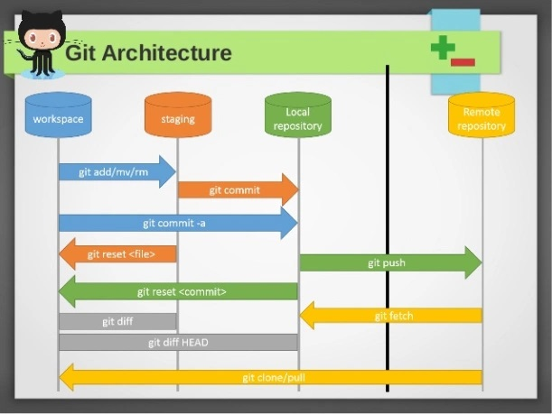

# Git Help

## Architecture



## 1. Commands short description

### 1.1. git config

Sets configuration values for your user name, email, gpg key, preferred diff algorithm, file formats and more.

Example:

``` bash
git config –global user.name “My Name”
git config –global user.email “user@domain.com”

cat ~/.gitconfig
[user]
name = My Name
email = user@domain.com
```

### 1.2. git init

Initializes a git repository – creates the initial ‘.git’ directory in a new or in an existing project.

Example:

``` bash
cd /home/user/my_new_git_folder/
git init
```

### 1.3. git clone

Makes a Git repository copy from a remote source. Also adds the original location as a remote so you can fetch from it again and push to it if you have permissions.

Example:

``` bash
git clone git@github.com:user/test.git
```

### 1.4. git add

Adds files changes in your working directory to your index.

Example:

``` bash
git add .
```

### 1.5. git rm

Removes files from your index and your working directory so they will not be tracked.

Example:

``` bash
git rm filename
```

### 1.6. git commit

Takes all of the changes written in the index, creates a new commit object pointing to it and sets the branch to point to that new commit.

Examples:

``` bash
git commit -m ‘committing added changes’
git commit -a -m ‘committing all changes, equals to git add and git commit’
```

### 1.7. git status

Shows you the status of files in the index versus the working directory. It will list out files that are untracked (only in your working directory), modified (tracked but not yet updated in your index), and staged (added to your index and ready for committing).

Example:

``` bash
git status
# On branch master
#
# Initial commit
#
# Untracked files:
#   (use “git add <file>…” to include in what will be committed)
#
#    README
nothing added to commit but untracked files present (use “git add” to track)
```

### 1.8. git branch

Lists existing branches, including remote branches if ‘-a’ is provided. Creates a new branch if a branch name is provided.

Example:

``` bash
git branch -a
* master
remotes/origin/master
```

### 1.9. git checkout

Checks out a different branch – switches branches by updating the index, working tree, and HEAD to reflect the chosen branch.

Example:

``` bash
git checkout newbranch
```

### 1.10. git merge

Merges one or more branches into your current branch and automatically creates a new commit if there are no conflicts.

Example:

``` bash
git merge newbranchversion
```

### 1.11. git reset

Resets your index and working directory to the state of your last commit.

Example:

``` bash
git reset –hard HEAD
```

### 1.12. git stash

Temporarily saves changes that you don’t want to commit immediately. You can apply the changes later.

Example:

``` bash
git stash
Saved working directory and index state “WIP on master: 84f241e first commit”
HEAD is now at 84f241e first commit
(To restore them type “git stash apply”)
```

### 1.13. git tag

Tags a specific commit with a simple, human readable handle that never moves.

Example:

``` bash
git tag -a v1.0 -m ‘this is version 1.0 tag’
```

### 1.14. git fetch

Fetches all the objects from the remote repository that are not present in the local one.

Example:

``` bash
git fetch origin
```

### 1.15. git pull

Fetches the files from the remote repository and merges it with your local one. This command is equal to the git fetch and the git merge sequence.

Example:

``` bash
git pull origin
```

### 1.16. git push

Pushes all the modified local objects to the remote repository and advances its branches.

Example:

``` bash
git push origin master
```

### 1.17. git remote

Shows all the remote versions of your repository.

Example:

``` bash
git remote
origin
```

### 1.18. git log

Shows a listing of commits on a branch including the corresponding details.

Example:

``` bash
git log
commit 84f241e8a0d768fb37ff7ad40e294b61a99a0abe
Author: User <user@domain.com>
Date:   Mon May 3 09:24:05 2010 +0300
```

first commit

### 1.19. git show

Shows information about a git object.

Example:

``` bash
git show
commit 84f241e8a0d768fb37ff7ad40e294b61a99a0abe
Author: User <user@domain.com>
Date:   Mon May 3 09:24:05 2010 +0300

first commit

diff –git a/README b/README
new file mode 100644
index 0000000..e69de29
```

### 1.20. git ls-tree

Shows a tree object, including the mode and the name of each item and the SHA-1 value of the blob or the tree that it points to.

Example:

``` bash
git ls-tree master^{tree}
100644 blob e69de29bb2d1d6434b8b29ae775ad8c2e48c5391    README
```

### 1.21. git cat-file

Used to view the type of an object through the SHA-1 value.

Example:

``` bash
git cat-file -t e69de29bb2d1d6434b8b29ae775ad8c2e48c5391
blob
```

### 1.22. git grep

Lets you search through your trees of content for words and phrases.

Example:

``` bash
git grep “www.siteground.com” — *.php
```

### 1.23. git diff

Generates patch files or statistics of differences between paths or files in your git repository, or your index or your working directory.

Example:

``` bash
git diff
```

### 1.24. gitk

Graphical Tcl/Tk based interface to a local Git repository

### 1.25. Git global setup

``` bash
git config --global user.name "Giovani Perotto Mesquita"
git config --global user.email "giovanipm@gmail.com"
git config --global core.excludesFile "~/.gitignore"
git config --global core.editor "C:\Users\Giovani_Mesquita\AppData\Local\Programs\Microsoft VS Code\Code.exe --wait"
```

### 1.26. Create a new repository

``` bash
git clone https://gitlab.com/GiovaniPM/NR.git
cd NR
touch README.md
git add README.md
git commit -m "add README"
git push -u origin master
```

### 1.27. Existing folder

``` bash
cd existing_folder
git init
git remote add origin https://gitlab.com/GiovaniPM/NR.git
git add .
git commit -m "Initial commit"
git push -u origin master
```

### 1.28. Existing Git repository

``` bash
cd existing_repo
git remote rename origin old-origin
git remote add origin https://gitlab.com/GiovaniPM/NR.git
git push -u origin --all
git push -u origin --tags
```